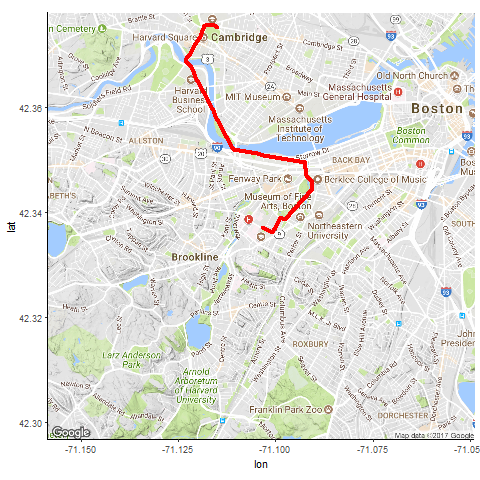

## Background and Motivation:

The Harvard T.H. Chan School of Public Health is located in the Longwood Medical area in Boston, while the main Harvard University campus is located in Cambridge. Many Harvard Chan students, staff, and faculty choose to live in Cambridge, and others cross-register for classes or attend events that are offered on the main campus. Thus, there is a need to determine the most cost-effective and efficient commute option between the two campuses, especially during rush-hour periods. The M2 shuttle provides a free option but can be unreliable, crowded, inflexible due to its set schedule, and takes an inefficient route in order to stop at popular locations along Massachusetts Avenue. The MBTA offers several routes that are also inefficient and can experience heavy traffic. A better option may be travel by car.

Taking Uber or Lyft may save time that could better be spent studying or working, especially if we can determine the best time to travel and the best service to use in order to get a good price. 

## Project Objectives

This project aims to determine which service, Uber or Lyft, has the cheaper price, lower wait time, and shorter ride duration during morning and evening rush-hour from Monday to Friday for the route from Vanderbilt Hall in Longwood to Widener Gate in Cambridge. Our scientific and inferential goals are to determine if there is a significant difference in prices between services for this route, and determine if wait times or trip durations significantly differ at different times of day and/or between the two services. This project has real-life, every day benefit for students, faculty, and staff at our school. Its results would help people to save money and time.

## Trying to get image to appear
You can also embed images, for example:

## Here is how we will include plots/images:

