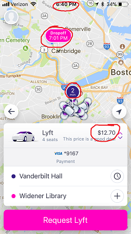

# Motivation

The Harvard T.H. Chan School of Public Health is located in the Longwood Medical area in Boston, while the main Harvard University campus is located in Cambridge. Many Harvard Chan students, staff, and faculty choose to live in Cambridge, and others cross-register for classes or attend events that are offered on the main campus. Thus, there is a need to determine the most cost-effective and efficient commute option between the two campuses, especially during rush-hour periods. The M2 shuttle provides a free option but can be unreliable, crowded, inflexible due to its set schedule, and takes an inefficient route in order to stop at popular locations along Massachusetts Avenue. The MBTA offers several routes that are also inefficient and can experience heavy traffic. A better option may be travel by car.

Taking Uber or Lyft may save time that could better be spent studying or working, especially if we can determine the best time to travel and the best service to use in order to get a good price. 

# Objectives

Our primary objective was to determine which ride service, Uber or Lyft, was a better option for traveling the 4.7 miles by car from the Longwood campus to the Cambridge campus during the morning (8-10am) and evening (5-7pm) rush hour periods. Through data visualization, we hoped to establish a guide for when to take each service. The following research questions guided our project:

* Which service is cheaper overall for our chosen route?
* What do the time of day/day of week trends in fares look like for each service?
* Which service is preferable based on cost and wait time during morning and evening rush hour?
* Which service has a shorter wait time and/or expectated time to destination?
* How does the cost per expected minute of travel compare for each service?

# Dataset

After checking the Uber and Lyft online dataset, they did not provide any price data, so we decided to create our own dataset.

We decided to collect the data ourselves. The 4-week collection period ran Monday-Friday from November 6 - December 1. We aimed to collect a total of 16 data points each day (8 Uber/Lyft pairs) for a total goal of 320 data points. Each team member used screenshots on his/her phone to collect the data each day: 1 Uber observation and 1 Lyft observation at random times between 8-9am, 9-10am, 5-6pm, and 6-7pm.

Each team member collected when they were able during each hour frame, with the hope that our collection times would be somewhat "random" and we would accumulate enough data over each time interval for meaningful analysis. We used the Uber and Lyft App to set the position from Vanderbilt Hall to Widener Gate. Then, we took a screenshot of the estimated price, wait time, and duration time. and later on that day, we imported our data on into a spreadsheet. An example data screenshot and a portion of the data collection spreadsheet can be found below:

 

# Analysis:

## Univariate Plots

### Time of Ride Request

The histogram below shows the distribution of the ride request times, with dotted lines representing the rush hour windows that we defined. As you can see, all rides were requested within the window. We hoped to request at random times within each window, which would result in a flat distribution across each window. The distribution is not perfectly flat, but it also doesn't look to have an obvious or concerning shape. The differences are likely due to a tendency to request within the first half of each hour so we did not forget.

### Cost

The boxplot below compares the distribution of cost by service during the morning and evening rush hour. In the morning rush hour, Lyft looks clearly cheaper than Uber. In the evening rush hour, costs for the two services look fairly similar, with Lyft still a bit cheaper than Uber.

### Total Duration

The boxplot gives us another way to view the longer expected Uber durations. During the evening rush hour, the median duration for Uber is greater than the median duration for Lyft. In the morning, the median durations are the same, and the distribution of Uber’s durations is more compact. We wonder if some of these differences in expected duration, especially in the evening, contributes to differences in ride cost. Based on the results we’ve seen so far, it seems that Lyft is likely to have better prices both morning and evening and shorter duration in the evening.

### Cost Per Minute

The boxplot shows the during the morning rush hour, Lyft’s cost per minute is more favorable than Uber’s. However, in the evening, Lyft and Uber’s cost per minute is about equal. This leads us to think that Uber’s longer expected duration is the reason behind the higher absolute cost for a ride that we saw before.

## Multivariate Plots

### Cost Trends Over Morning/Evening Rush Hours

The plots below allow us to visualize trend in ride cost for the morning and evening rush hours over a typical week. It is pretty obvious from the morning plot that Lyft is most often the cheaper service. There are some outlier high costs that look to happen before 9am. In the evening, there is not as clear of a difference between services, but looking at the very bottom of the graph, it seems that there is a row of low-price Lyft rides with a row of Uber rides with slightly higher costs just above this. Our statistical anaylsis will tell us more about this.

In both plots, it’s difficult to tell what the cost trends are over the course of rush hour, so this will need to be investigated further during the final analysis.

 

### Cost vs Total Duration

We next looked at cost of a ride versus total duration. In general, there looks to be a positive association between cost and duration. It is interesting that Lyft cost never goes above $30 even for high duration rides, while Uber has many rides that cost above that.

We stratified the above plot further by morning/evening rush hour in order to get a better sense of when these differences were occurring. It looks like in the morning rush hour, as we’ve seen before, there are small but consistent differences between services, and the large cost differences and high duration rides occur during the evening rush hour. The positive trend is more visible in the evening plot than in the morning plot.

# Final Analysis

## Time Trend for Cost

The plot below answers both this question and the previous question about cost, showing the average price for each service in 15 minutes increments during the morning and evening rush hours. It looks as though the highest price during the day is concentrated between 5:30-6pm; during part of that time, Lyft is more expensive, and during part, Uber is more expensive (we will explore this later in our guide). These high prices could be due to traffic and/or the large number of people leaving work around that time each day. It is interesting that there is no major spike for the morning. Maybe there would have been a spike if we had reversed the direction of the route.

## Guide to Preferred Service Based on Cost and wait Time

In order to answer the question: Which service is preferable based on cost and wait time during morning and evening rush hour?

we developed a decision-making process between Uber and Lyft that we thought was reasonable. We then took the proportion of “wins” for Lyft/Uber and plotted. The decision-making process was the following:

If one service is more than $2 cheaper, take that service.
If the services are within $2 of each other, take the one with the shorter wait time.
If wait time are equivalent and services are within $2 of each other, take the cheaper service.
If cost and wait time are exactly equal (this didn’t happen in our dataset), flip a coin.

Based on the plot below, we can clearly see that we should choose Lyft other than Uber for the most of time during the day. However during the 17:45pm to 18pm, we can choose Uber. As for the time period between 18:15pm to 18:30pm, the cost of Uber and lyft is similar. After grouping the data into 15-minute intervals, we also looked at which 15-minute interval had the lowest average cost and wait time. We found that in the morning, 9:30-9:45 was the best time to travel, and in the evening, 7:45-9pm was the best time to travel. This makes sense, given that these are both on the tail end of rush hour.

