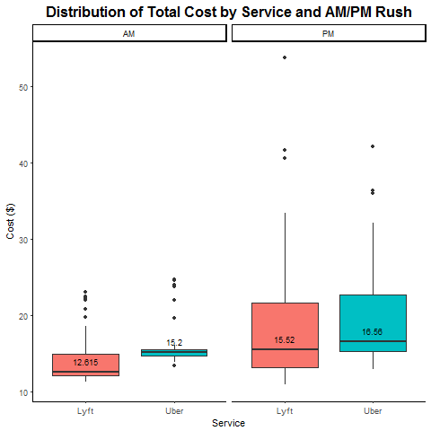
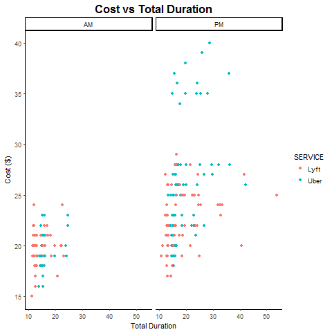
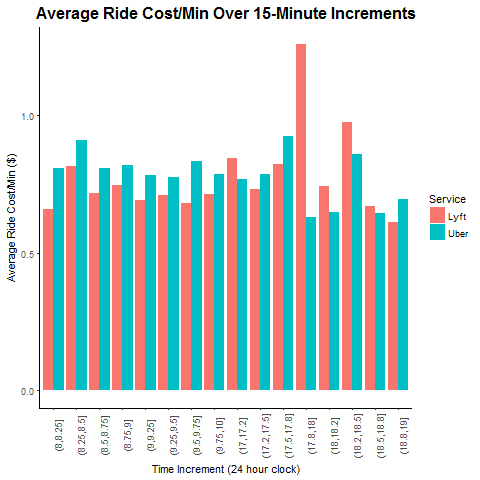

Authors: Kara Higgins & Ray An

# Screencast

<iframe width="560" height="315" src="https://www.youtube.com/embed/N6p6LRtQ2WY" frameborder="0" gesture="media" allow="encrypted-media" allowfullscreen></iframe>

# Overview & Motivation

The Harvard T.H. Chan School of Public Health is located in the Longwood Medical area in Boston, while the main Harvard University campus is located in Cambridge. Many Harvard Chan students, staff, and faculty choose to live in Cambridge, and others cross-register for classes or attend events that are offered on the main campus. Thus, there is a need to determine the most cost-effective and efficient commute option between the two campuses, especially during rush-hour periods. The M2 shuttle provides a free option but can be unreliable, crowded, inflexible due to its set schedule, and takes an inefficient route in order to stop at popular locations along Massachusetts Avenue. The MBTA offers several routes that are also inefficient and can experience heavy traffic. A better option may be travel by car.

Taking Uber or Lyft from Longwood to Cambridge may save time that could better be spent studying or working, especially if we can determine the best time to travel and the best service to use in order to get a good price. 

# Background

There are dozens of online resources that compare different aspects of Uber, Lyft, and sometimes taxi services. Some interesting examples are:

* This article by [RideGuru](https://ride.guru/content/newsroom/uber-vs-lyft-vs-taxi-cost-analysis-across-the-united-states) shows a side-by-side price comparison of all three services in Boston and compares the Boston prices for a 4-mile ride to prices in other cities around the U.S. The figure on the website shows that Lyft was slightly cheaper in Boston, based on the data they gathered. 
* Another article by [Alvia](http://www.alvia.com/lyft-vs-uber/) presents an estimate of the pricing algorithms for each service. It says that Uber fares are generally cheaper nationwide, but the price comparison is dependent on location and whether there is a surge.
* Finally, [FareEstimate.com](http://www.fareestimate.com/) is a website where users can input a pickup and dropoff location and instantly view a price comparison of all Uber and Lyft services.

Both the [Uber](https://help.uber.com/h/d2d43bbc-f4bb-4882-b8bb-4bd8acf03a9d) and [Lyft](https://help.lyft.com/hc/en-us/articles/214218147-How-to-calculate-a-Lyft-ride-s-cost) websites are vague about their pricing algorithms, which seems to be partially due to the new upfront pricing feature in both apps, as well as possible pricing differences by city.

# Objectives & Research Questions

Our primary objective was to determine which ride service, Uber or Lyft, was a better option for traveling the 4.7 miles by car from the Longwood campus to the Cambridge campus during the morning (8-10am) and evening (5-7pm) rush hour periods. Through data visualization, we hoped to establish a guide for when to take each service. The following research questions guided our project:

* Which service is cheaper overall for our chosen route?
* What do the time trends in fares look like for each service during weekdays?
* Which service is preferable based on cost and wait time during morning and evening rush hour?
* Which service has a shorter wait time and/or expectated time to destination?
* When is the best ride request time within each rush hour period to minimize cost and wait time?
* How does the cost per expected minute of travel compare for each service?

# Dataset

Uber and Lyft both offer an application programming interface with some of their data publicly available for developers; however, it was beyond our coding abilities to understand and use this data, so we decided to create our own dataset by collecting the data ourselves.

Our 4-week collection period ran Monday-Friday each week from November 6 - December 1. We aimed to collect a total of 16 data points each day (8 Uber/Lyft pairs) for a total goal of 320 data points. Each team member used screenshots on his/her phone to collect the data each day: 1 Uber observation and 1 Lyft observation at random times between 8-9am, 9-10am, 5-6pm, and 6-7pm.

Each team member collected when they were able during each hour frame, with the hope that our collection times would be somewhat "random" and we would accumulate enough data over each time interval for meaningful analysis. We used the Uber and Lyft App to set the position from Vanderbilt Hall in Longwood to Widener Gate in Cambridge. Then, we took a screenshot of the estimated price, wait time, and duration time for a standard ride (not "Pool" or "Line"). Later on that day, we imported our data on into a spreadsheet. Example screenshots can be found below.

 

# Overview of the Data

### Time of Ride Request

The histogram below shows the distribution of the ride request times, with dotted lines representing the rush hour windows that we defined. We aimed to collect about evenly at times throughout each morning/evening window.

### Cost

The boxplot below compares the distribution of cost by service during the morning and evening rush hour. In the morning rush hour, Lyft looks clearly cheaper than Uber. In the evening rush hour, costs for the two services look fairly similar, with Lyft still a bit cheaper than Uber.

### Total Duration

In the boxplot below, you can see that Uber tends to have longer duration than Lyft, despite that fact that we collected data for each service at the same times each day. During the evening rush hour, the median duration for Uber is greater than the median duration for Lyft. In the morning, the median durations are the same, and the distribution of Uber’s durations is more compact. We wonder if some of these differences in expected duration, especially in the evening, contributes to differences in ride cost.

### Cost Per Minute

Because of our observations about differences in cost and differences in duration, we also examined cost per minute. The boxplot shows the during the morning rush hour, Lyft’s cost per minute is more favorable than Uber’s. However, in the evening, Lyft and Uber’s median cost per minute is about equal. Is Uber’s longer expected duration the reason behind the higher absolute cost for a ride that we saw before? We test this in our analysis.

### Cost vs Total Duration

It looks like in the morning rush hour, there are small but consistent differences between services, and the large cost differences and high duration rides occur during the evening rush hour. The positive trend is more visible in the evening plot than in the morning plot.

# Data Analysis

In our final analysis, we ran several statistical tests to answer our initial research questions, including establishing a guide for when to travel and when to take each car service.

### Which service is cheaper overall for our chosen route?

We used a Mann-Whitney U test to determine which service was cheaper overall for our chosen route, since there looked to be a difference based on the boxplot shown above. The Mann-Whitney U test tests the probability that a randomly selected Uber price is less than a randomly selected Lyft price. The null hypothesis is that the probability is 0.5, equivalent to a coin flip. The test result (p<.001) told us that the probability that a randomly selected Uber price is less than a randomly selected Lyft price, for all times combined, is significantly less than 0.5. Overall, Lyft is the cheaper service for this route.

We did the same test for the morning commute only and for the evening commute only and found that Lyft was significantly cheaper than Uber at both of those times (p<0.001, p=0.005, respectively).

### What do the time trends in fares look like for each service during weekdays, and when is the best time to travel?

The plots below allow us to visualize trend in ride cost for the morning and evening rush hours over a typical week. It is pretty obvious from the morning plot that Lyft is most often the cheaper service. There are some outlier high costs that look to happen before 9am. In the evening, there is not as clear of a difference between services, but looking at the very bottom of the graph, it seems that there is a row of low-price Lyft rides with a row of Uber rides with slightly higher costs just above this. Our statistical analysis tells us more about this.

 

The plot below answers both this question about time trends and the previous question about cost, showing the average price for each service in 15 minutes increments during the morning and evening rush hours. It looks as though the highest price during the day is concentrated between 5:30-6pm; during part of that time, Lyft is more expensive, and during part, Uber is more expensive (we will explore this later). These high prices could be due to traffic and/or the large number of people leaving work around that time each day. It is interesting that there is no major spike for the morning. Maybe there would have been a spike if we had reversed the direction of the route.

After grouping the data into 15-minute intervals, we also looked at which 15-minute interval had the lowest average cost and wait time. We found that in the morning, 9:30-9:45 was the best time to travel, and in the evening, 7:45-9pm was the best time to travel. This makes sense, given that these are both on the tail end of rush hour.

### How does the cost per expected minute of travel compare for each service?

Below is a plot similar to the one just displayed, but instead of showing cost, it shows cost per minute. We can draw very similar conclusions from this plot about the busiest and most expensive time to travel, as well as the comparison of cost between services.

We used the Mann-Whitney U test again to test whether a randomly selected Uber's cost per minute was less than a randomly selected Lyft's cost per minute. We concluded that even based on cost per minute, Uber is more expensive than Lyft (p<0.001). This means we can't blame the price difference on a difference in duration. Uber's rates must just be higher on average for this route at this time.

### Which service has a shorter expectated time to destination?

In order to visualize the expected duration, we took the average duration over 15-minute intervals within each rush hour period. In the evening, it is clear that on average, Uber's estimated duration is greater than Lyft's expected duration. We're still not sure why this is, but we assume it must have to do with differences in their estimation algorithms. An interesting extension of this project would be to see which service's estimations are more accurate, but that would require actually paying for and taking the rides, or having some other data source with that information.

### Which service is preferable based on cost and wait time during morning and evening rush hour?

We developed a decision-making process between Uber and Lyft that we thought was reasonable. We then took the proportion of “wins” for Lyft/Uber and plotted. The decision-making process was the following:

* If one service is more than $2 cheaper, take that service.
* If the services are within $2 of each other, take the one with the shorter wait time.
* If wait time are equivalent and services are within $2 of each other, take the cheaper service.
* If cost and wait time are exactly equal (this didn’t happen in our dataset), flip a coin.

Based on the plot, we can clearly see that we should choose Lyft rather than Uber for the most of time during the day. However from 5:45pm to 6pm, Uber may be a more sensible decision. From 6:15pm to 6:30pm, the costs of Uber and lyft are similar.

