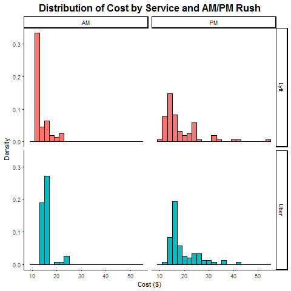
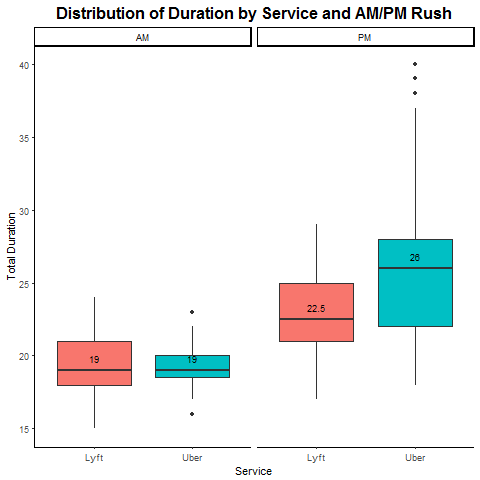
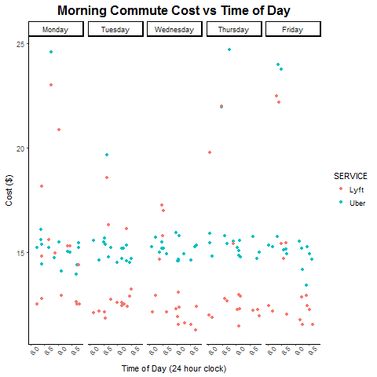

title: "Uber or Lyft: Which is the Better Option from Longwood to Harvard Square?"
author: "Kara Higgins and Ray An"

## Overview & Motivation

The Harvard T.H. Chan School of Public Health is located in the Longwood Medical area in Boston, while the main Harvard University campus is located in Cambridge. Many Harvard Chan students, staff, and faculty choose to live in Cambridge, and others cross-register for classes or attend events that are offered on the main campus. Thus, there is a need to determine the most cost-effective and efficient commute option between the two campuses, especially during rush-hour periods. The M2 shuttle provides a free option but can be unreliable, crowded, inflexible due to its set schedule, and takes an inefficient route in order to stop at popular locations along Massachusetts Avenue. The MBTA offers several routes that are also inefficient and can experience heavy traffic. A better option may be travel by car.

Taking Uber or Lyft may save time that could better be spent studying or working, especially if we can determine the best time to travel and the best service to use in order to get a good price. 

## Background

There are dozens of online resources that compare different aspects of Uber, Lyft, and sometimes taxi services. Some interesting examples are:

* This article by [RideGuru](https://ride.guru/content/newsroom/uber-vs-lyft-vs-taxi-cost-analysis-across-the-united-states) shows a side-by-side price comparison of all three services in Boston and compares the Boston prices for a 4-mile ride to prices in other cities around the U.S. The figure on the website shows that Lyft was slightly cheaper in Boston, based on the data they gathered. 
* Another article by [Alvia](http://www.alvia.com/lyft-vs-uber/) presents an estimate of the pricing algorithms for each service. It says that Uber fares are generally cheaper nationwide, but the price comparison is dependent on location and whether there is a surge.
* Finally, [FareEstimate.com](http://www.fareestimate.com/) is a website where users can input a pickup and dropoff location and instantly view a price comparison of all Uber and Lyft services.

Both the [Uber](https://help.uber.com/h/d2d43bbc-f4bb-4882-b8bb-4bd8acf03a9d) and [Lyft](https://help.lyft.com/hc/en-us/articles/214218147-How-to-calculate-a-Lyft-ride-s-cost) websites are vague about their pricing algorithm, which seems to be partially due to the new upfront pricing feature in both apps, as well as possible pricing differences by city.

## Initial Questions

Our primary objective was to determine which ride service, Uber or Lyft, was a better option for traveling the 4.7 miles by car from the Longwood campus to the Cambridge campus during the morning (8-10am) and evening (5-7pm) rush hour periods. Through data visualization, we hoped to establish a guide for when to take each service. The following research questions guided our project:

* Which service is cheaper overall for our chosen route?
* What do the time of day/day of week trends in fares look like for each service?
* Which service is preferable based on cost and wait time during morning and evening rush hour?
* Which service has a shorter wait time and/or expectated time to destination?
* How does the cost per expected minute of travel compare for each service?

## Data Collection & Cleaning

After checking the Uber and Lyft online dataset, they did not provide any price data, so we decided to create our own dataset.

We decided to collect the data ourselves. The 4-week collection period ran Monday-Friday from November 6 - December 1. We aimed to collect a total of 16 data points each day (8 Uber/Lyft pairs) for a total goal of 320 data points. Each team member used screenshots on his/her phone to collect the data each day: 1 Uber observation and 1 Lyft observation at random times between 8-9am, 9-10am, 5-6pm, and 6-7pm.

Each team member collected when they were able during each hour frame, with the hope that our collection times would be somewhat "random" and we would accumulate enough data over each time interval for meaningful analysis. We used the Uber and Lyft App to set the position from Vanderbilt Hall to Widener Gate. Then, we took a screenshot of the estimated price, wait time, and duration time. and later on that day, we imported our data on into a spreadsheet. An example data screenshot and a portion of the data collection spreadsheet can be found below:

 

## Exploratory Analysis:

Lots of plots and text about what we found out.

The code below shows our data cleaning/formatting process. Variable specifications can be found in the comments of the code and are also displayed in the table below 

Talk about how we had to remove rows for missing observations.

The first plot we have is the distribution of the ride request time plot. We can find that ride request time during the morning rush hour is normally distributed, but druing the night rush hour, the ride requet time varies a lot. 

The third plot we have is the distribution of cost by two service druing morning and evening rush hour by using histogram. 

The fourth plot we have is the distribution of cost by two service druing morning and evening rush hour by using boxplot, we find that in the moring rush hour, the Lyft is cheaper than uber, but in the evening rush hour, the two service are kind of similar, Lyft is still a little bit cheaper than Uber.

The fifth plot we have is the one that descirbe that the distribution of cost per minute by two service druing morning and evening rush hour by using histogram.

The sixth plot we have is the one that descirbe that the distribution of cost per minute by two service druing morning and evening rush hour by using boxplot. We can find that during the moring rush hour, the cost per minute of Lyft is cheaper than Uber. But druing the evening rush hour, the cost per minute of Uber is cheaper than Lyft. This happens becasue the total duration of Uber is longer than Lyft. 

The seventh plot we have is the one that descirbe the distribution of wait time by two service during the morning and evening rush hour by using histogram. 

The eighth plot we have is the one that descirbe the distribution of total duration by two service during the morning and evening rush hour by using histogram. 

The eighth plot we have is the one that descirbe the distribution of total duration by two service during the morning and evening rush hour by using histogram. 

The ninghth plot we have is the one that descirbe the distribution of total duration by two service during the morning and evening rush hour by using boxplot. We cna find that the during the morning rush hour, the total duration of Lyft is longer than uber, but during the night rush hour, the total duration of Lyft is shorter than Uber.

The tenth plot we have is the one that compare the price for two service during the morning rush hour. We can find that Lyft is cheaper than Uber for most of time. 

The evelenth plot we have is the one that compare the price for two service during the evening rush hour. We can find the price between the Lyft and uber is similar. 

The twelveth plot we have is the one that describe the average price in 15 minutes increments during the morning rush hour. 

The thirtennth plot we have is the one that describe the cost vs total duration by two service. 

The fifteenth plot we have is the one that describe the

#Final Analysis(we need to put our test scores and p-values here)

We want to know whether total ride duration and total cost are correlated, we decide to use the SPEARMAN AND MANN-WHITNEY U TEST, and based on the result of the tes, we find that the total ride duration and total cost are correlated, the r=0.585. the p-value is less than 0.05.

We want to know whether whether wait time and total cost are correlated, we decide to use the SPEARMAN AND MANN-WHITNEY U TEST, and based on the result of the tes, we find that the wait time and total cost are correlated, the r=0.528. the p-value is less than 0.05.

We want to know whether whether wait time and total cost/min are correlated, we decide to use the SPEARMAN AND MANN-WHITNEY U TEST, and based on the result of the tes, we find that the wait time and total cost are not that correlated, the r=-0.0268. the p-value is more than 0.05.

we want to tests probaility that a randomly selected Uber price is greater than a randomly selected Lyft price, than the test result told us that a randomly selected Uber price is greater than a randomly selected Lyft price. 

we want to tests probaility that a randomly selected Uber price is greater than a randomly selected Lyft price duing the morning rush hour, than the test result told us that a randomly selected Uber price is greater than a randomly selected Lyft price during the morning rush hour. 

we want to tests probaility that a randomly selected Uber price is greater than a randomly selected Lyft price during the evening rush hour, than the test result told us that a randomly selected Uber price is not greater than a randomly selected Lyft price during the evening rush hour. 

we want to tests prob that a randomly selected Uber's cost per minute is greater than a rand selected Lyft's  cost per minute, than the test result told us that a randomly selected Uber's cost per minute is greater than a randomly selected Lyft's  cost per minute.

