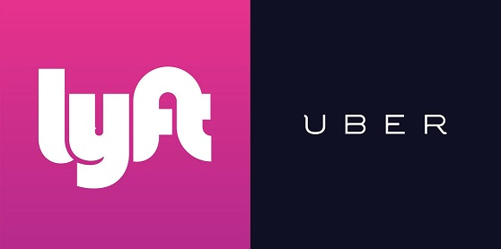

# Motivation

The Harvard T.H. Chan School of Public Health is located in the Longwood Medical area in Boston, while the main Harvard University campus is located in Cambridge. Many Harvard Chan students, staff, and faculty choose to live in Cambridge, and others cross-register for classes or attend events that are offered on the main campus. Thus, there is a need to determine the most cost-effective and efficient commute option between the two campuses, especially during rush-hour periods. The M2 shuttle provides a free option but can be unreliable, crowded, inflexible due to its set schedule, and takes an inefficient route in order to stop at popular locations along Massachusetts Avenue. The MBTA offers several routes that are also inefficient and can experience heavy traffic. A better option may be travel by car.

Taking Uber or Lyft may save time that could better be spent studying or working, especially if we can determine the best time to travel and the best service to use in order to get a good price. 

# Objectives

Our primary objective was to determine which ride service, Uber or Lyft, was a better option for traveling the 4.7 miles by car from the Longwood campus to the Cambridge campus during the morning (8-10am) and evening (5-7pm) rush hour periods. Through data visualization, we hoped to establish a guide for when to take each service. The following research questions guided our project:

* Which service is cheaper overall for our chosen route?
* What do the time of day/day of week trends in fares look like for each service?
* Which service is preferable based on cost and wait time during morning and evening rush hour?
* Which service has a shorter wait time and/or expectated time to destination?
* How does the cost per expected minute of travel compare for each service?

# Dataset

After checking the Uber and Lyft online dataset, they did not provide any price data, so we decided to create our own dataset.

We decided to collect the data ourselves. The 4-week collection period ran Monday-Friday from November 6 - December 1. We aimed to collect a total of 16 data points each day (8 Uber/Lyft pairs) for a total goal of 320 data points. Each team member used screenshots on his/her phone to collect the data each day: 1 Uber observation and 1 Lyft observation at random times between 8-9am, 9-10am, 5-6pm, and 6-7pm.

Each team member collected when they were able during each hour frame, with the hope that our collection times would be somewhat "random" and we would accumulate enough data over each time interval for meaningful analysis. We used the Uber and Lyft App to set the position from Vanderbilt Hall to Widener Gate. Then, we took a screenshot of the estimated price, wait time, and duration time. and later on that day, we imported our data on into a spreadsheet. An example data screenshot and a portion of the data collection spreadsheet can be found below:

 

# Analysis:

## Univariate Plots

### Time of Ride Request

The histogram below shows the distribution of the ride request times, with dotted lines representing the rush hour windows that we defined. As you can see, all rides were requested within the window. We hoped to request at random times within each window, which would result in a flat distribution across each window. The distribution is not perfectly flat, but it also doesn't look to have an obvious or concerning shape. The differences are likely due to a tendency to request within the first half of each hour so we did not forget.

### Cost

The boxplot below compares the distribution of cost by service during the morning and evening rush hour. In the morning rush hour, Lyft looks clearly cheaper than Uber. In the evening rush hour, the two service look kind of similar, with Lyft still a little bit cheaper than Uber.

### Total Duration

The boxplot we have is the one that descirbe the distribution of total duration by two service during the morning and evening rush hour by using boxplot. We cna find that the during the morning rush hour, the mean of the total duration of Lyft is same with uber, but overall Uber takes less total duration time than Lyft. During the evening rush hour, the mean of the total duration of Lyft is shorter than Uber, overall Lyft takes less total duration time than Uber, this is oppsite with the morning rush hour result. 

## Multivariate Plots

### Cost druing morning rush hour

The plot we have below is the one that compare the price for two service during the morning rush hour. We can find that Lyft is cheaper than Uber for most of time. But for both of Lyft and uber, they did have some higher price outliers.

 

### Cost during evening rush hour

The plot we have below is the one that compare the price for two service during the evening rush hour. We can find the price between the Lyft and uber is similar. We can the cost of lyft and uber is kind of mixed with each other. However, we can still see the bottome line (lower cost) in thsi plot still shows that Lyft have a lower price. 

### Service vs Cost

The plot we have below is the one that describe the cost vs total duration by two service. We can see from the plot that Uber has several highest cost outliers compared with Lyft. Overall lyft has a lower price than uber. 

#Final Analysis

In our final analysis, we ran several statistical tests to assess the correlation between variables in our dataset and see which variables may guide our choice of service.

## Time trend for Cost

The plot we have below is the one that describe the average price in 15 minutes increments during the morning and evening rush hour. We can see clearly that the higest price druing the day is concentrated between 17:30pm to 18:00pm. That could means the worst traffic time period of Boston city is between 17:30pm to 18:00pm.

##Cost/minute

The plot below we have is the one that descirbe that the distribution of cost per minute by two service druing morning and evening rush hour by using boxplot. We can find that during the moring rush hour, the cost per minute of Lyft is cheaper than Uber. But druing the evening rush hour, the cost per minute of Uber is cheaper than Lyft. This could happens becasue the total duration of Uber is longer than Lyft. 

## Guide to Preferred Service Based on Cost and wait Time

Based on the plot below, we can clearly see that we should choose Lyft other than Uber for the most of time during the day. However during the 17:45pm to 18pm, we can choose Uber. As for the time period between 18:15pm to 18:30pm, the cost of Uber and lyft is similar. 

