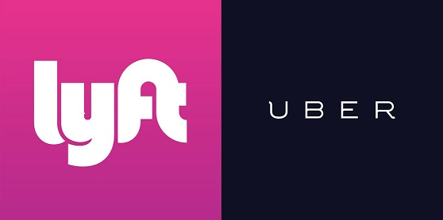
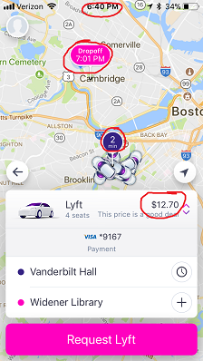

```{r setup, include=FALSE}
knitr::opts_chunk$set(echo = TRUE, fig.align ="center")
```

## Overview & Motivation



The Harvard T.H. Chan School of Public Health is located in the Longwood Medical area in Boston, while the main Harvard University campus is located in Cambridge. Many Harvard Chan students, staff, and faculty choose to live in Cambridge, and others cross-register for classes or attend events that are offered on the main campus. Thus, there is a need to determine the most cost-effective and efficient commute option between the two campuses, especially during rush-hour periods. The M2 shuttle provides a free option but can be unreliable, crowded, inflexible due to its set schedule, and takes an inefficient route in order to stop at popular locations along Massachusetts Avenue. The MBTA offers several routes that are also inefficient and can experience heavy traffic. A better option may be travel by car.

Taking Uber or Lyft may save time that could better be spent studying or working, especially if we can determine the best time to travel and the best service to use in order to get a good price. 

## Background

ASSIGN TO SOMEONE FOR THE WEEKEND

We are going to talk about what other datasets or studies we looked at. We may also want to include information about how the Uber/Lyft algorithms work. We should be able to find this online.

## Initial Questions

Our primary objective was to figure out which ride service, Uber or Lyft, was a better option for traveling from the Longwood campus to the Cambridge campus. Through data visualization, we hoped to establish a guide for when to take which service. The following research questions guided our project:

* Which service is cheaper overall?
* Did ride prices vary in a similar way between services over different times?
* Which service is preferable during morning vs. evening rush hour?
* Which service has a long wait time and/or expectated time to destination?
* How does the cost/minute compare for each service?

## Data Collection & Cleaning

After checking the Uber and Lyft online dataset, they did not provide any price data, so we decided to create our own dataset.

We decided to collect the data ourselves. The 4-week collection period ran Monday-Friday from November 6 - December 1. We aimed to collect a total of 16 data points each day (8 Uber/Lyft pairs) for a total goal of 320 data points. Each team member used screenshots on his/her phone to collect the data each day: 1 Uber observation and 1 Lyft observation at random times between 8-9am, 9-10am, 5-6pm, and 6-7pm.

Each team member collected when they were able during each hour frame, with the hope that our collection times would be somewhat "random" and we would accumulate enough data over each time interval for meaningful analysis. We used the Uber and Lyft App to set the position from Vanderbilt Hall to Widener Gate. Then, we took a screenshot of the estimated price, wait time, and duration time. and later on that day, we imported our data on into a spreadsheet. An example data screenshot and a portion of the spreadsheet can be found below:

#### Sample Screenshots

 

#### Portion of spreadsheet
PUT head(data2) here

## Exploratory Analysis:

Lots of plots and text about what we found out.

```{r, echo=FALSE}
#Our code here
```

```{r, echo=FALSE}
#Our code here
```

```{r, echo=FALSE}
#Our code here
```

#Final Analysis

```{r, echo=FALSE}
#Our code here
```

```{r, echo=FALSE}
#Our code here
```

```{r, echo=FALSE}
#Our code here
```

```{r, echo=FALSE}
#Our code here
```
