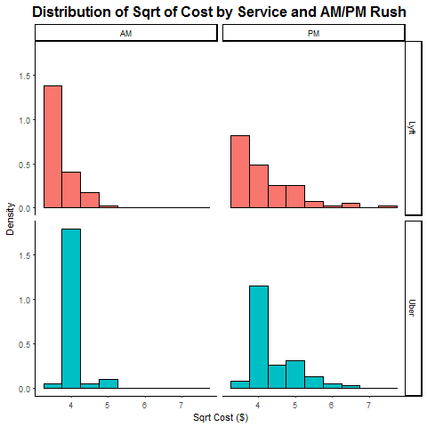
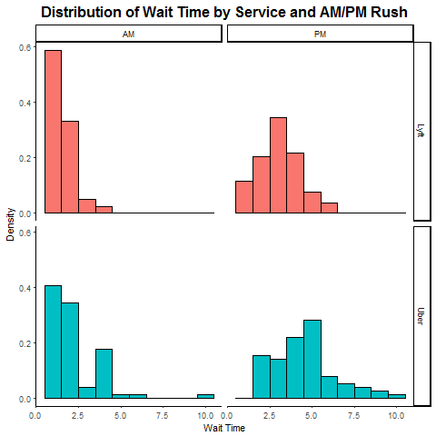
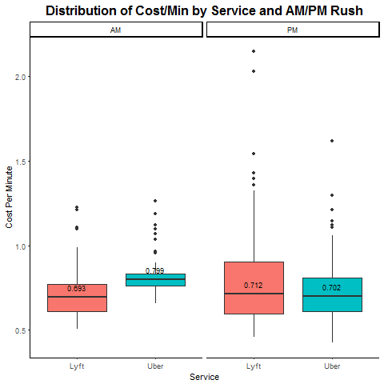
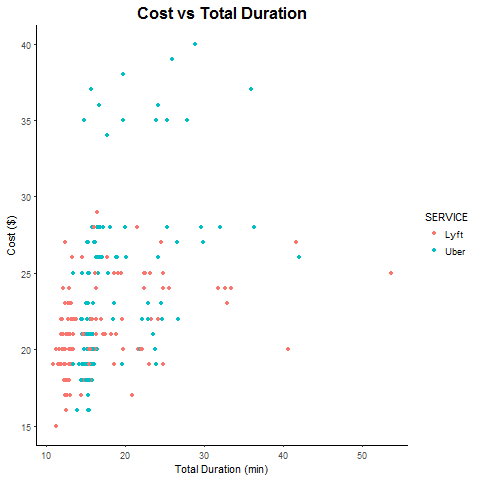
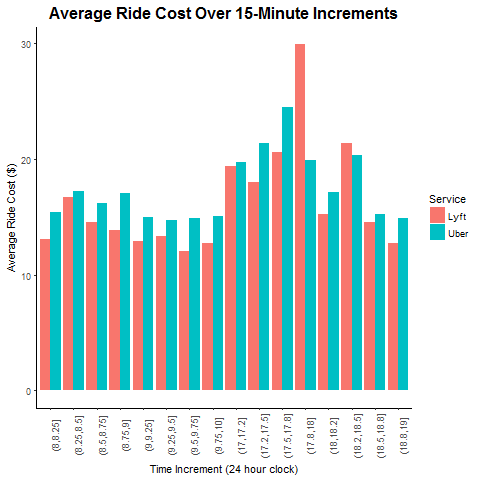
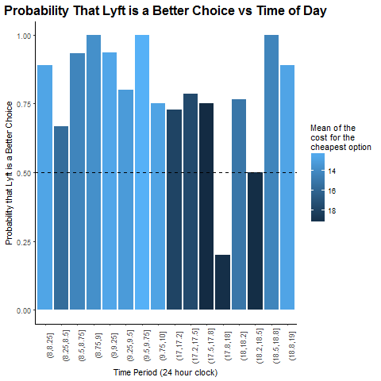

```{r setup, include=FALSE}
knitr::opts_chunk$set(echo = F)
```

Note: Please find the data in our final project repository. It is called FREEZE_FINAL_4DEC2017.csv.

```{r, echo=FALSE, message=F, warning=F}
library(knitr)
library(tidyverse)
library(lubridate)
library(stringr)
library(ggplot2)
library(ggthemes)
library(ggrepel)
library(dslabs)
library(lubridate)
library(broom)
ds_theme_set(new="theme_classic")
```


# Overview & Motivation


The Harvard T.H. Chan School of Public Health is located in the Longwood Medical area in Boston, while the main Harvard University campus is located in Cambridge. Many Harvard Chan students, staff, and faculty choose to live in Cambridge, and others cross-register for classes or attend events that are offered on the main campus. Thus, there is a need to determine the most cost-effective and efficient commute option between the two campuses, especially during rush-hour periods. The M2 shuttle provides a free option but can be unreliable, crowded, inflexible due to its set schedule, and takes an inefficient route in order to stop at popular locations along Massachusetts Avenue. The MBTA offers several routes that are also inefficient and can experience heavy traffic. A better option may be travel by car.

Taking Uber or Lyft from Longwood to Cambridge may save time that could better be spent studying or working, especially if we can determine the best time to travel and the best service to use in order to get a good price. 

# Background

There are dozens of online resources that compare different aspects of Uber, Lyft, and sometimes taxi services. Some interesting examples are:

* This article by [RideGuru](https://ride.guru/content/newsroom/uber-vs-lyft-vs-taxi-cost-analysis-across-the-united-states) shows a side-by-side price comparison of all three services in Boston and compares the Boston prices for a 4-mile ride to prices in other cities around the U.S. The figure on the website shows that Lyft was slightly cheaper in Boston, based on the data they gathered. 
* Another article by [Alvia](http://www.alvia.com/lyft-vs-uber/) presents an estimate of the pricing algorithms for each service. It says that Uber fares are generally cheaper nationwide, but the price comparison is dependent on location and whether there is a surge.
* Finally, [FareEstimate.com](http://www.fareestimate.com/) is a website where users can input a pickup and dropoff location and instantly view a price comparison of all Uber and Lyft services.

Both the [Uber](https://help.uber.com/h/d2d43bbc-f4bb-4882-b8bb-4bd8acf03a9d) and [Lyft](https://help.lyft.com/hc/en-us/articles/214218147-How-to-calculate-a-Lyft-ride-s-cost) websites are vague about their pricing algorithms, which seems to be partially due to the new upfront pricing feature in both apps, as well as possible pricing differences by city.

# Initial Questions

Our primary objective was to determine which ride service, UberX or Lyft (standard car service, not LyftLine), was a better option for traveling the 4.7 miles by car from the Longwood campus to the Cambridge campus during the morning (8-10am) and evening (5-7pm) rush hour periods. Through data visualization, we hoped to establish a guide for when to take each service. The following research questions guided our project:

* Which service is cheaper overall for our chosen route?
* What do the time trends in fares look like for each service during weekdays?
* Which service is preferable based on cost and wait time during morning and evening rush hour?
* Which service has a shorter wait time and/or expectated time to destination?
* When is the best ride request time within each rush hour period to minimize cost and wait time?

While collecting the data, we noticed variability in duration times for the same theoretical route at the same time of day, so we added one more research question:

* How does the cost per expected minute of travel compare for each service?

# The Data

Uber and Lyft both offer an application programming interface with some of their data publicly available for developers; however, it was beyond our coding abilities to understand and use this data, so we decided to create our own dataset by collecting the data ourselves.

Our 4-week collection period ran Monday-Friday each week from November 6 - December 1. We aimed to collect a total of 16 data points each day (8 Uber/Lyft pairs) for a total goal of 320 data points. Each team member used screenshots on his/her phone to collect the data each day: 1 Uber observation and 1 Lyft observation at random times between 8-9am, 9-10am, 5-6pm, and 6-7pm.

Each team member collected when they were able during each hour frame, with the hope that our collection times would be somewhat "random" and we would accumulate enough data over each time interval for meaningful analysis. We used the Uber and Lyft App to set the position from Vanderbilt Hall in Longwood to Widener Gate in Cambridge. Then, we took a screenshot of the estimated price, wait time, and duration time for a standard ride (not "Pool" or "Line"). Later on that day, we imported our data on into a spreadsheet. An example data screenshot and a portion of the data collection spreadsheet can be found below:

## Sample Data Collection Screenshots

We used screenshots like these to quickly capture data throughout the day, and we kept them on file in case we had a question about the accuracy of the data during analysis. The parts of the screenshot that were transferred to the spreadsheet are circled in red.

 


## Data Collection Spreadsheet

Below is the first portion our our data collection spreadsheet, to give an idea of how we collected data. Variable descriptions are provided later on.

```{r, echo=F, message=F, warning=F}
#Reading in data
data_location <- paste(getwd(),"/FREEZE_FINAL_4DEC2017.csv", sep="")
data <- read.csv(data_location, stringsAsFactors = F)
head(data) %>% kable(align='c')
```

## Data Cleaning and Formatting

Our data cleaning/formatting process was relatively straightforward. Because we had carefully designed the data collection process with analysis in mind and controlled the collection ourselves, there was not too much cleaning that needed to be done. Our work mostly consisted of formatting the variables. We left the code visible here so that the process can clearly be seen. Variable specifications can be found in the comments of the code and are also displayed in the table following the code.

There were 6 scheduled observation times for which data for both Uber and Lyft was not collected. We assumed that those were missing completely at random and removed them from the dataset. The only other missing data point was the arrival time (and therefore duration) for a Lyft data point between 8-9am on November 16. This happened because a screenshot was taken before the app displayed the estimated arrival time. We assumed this was also missing completely at random and removed this observation. The resulting dataset had 313 observations.

```{r, echo=T, message=F}
#Formatting and cleaning data
#   DATE: Date of request. Format=date (need to specify further based on R formats avail.)
#   DAY_OF_WK: Day of week of request. Format=factor w/ 5 levels
#   REQUEST_DATETIME: Date and time combined. Format=R date
#   TIME: Time of request, calculated as hours/min since start of the day. Format=R time
#   SERVICE: Uber/Lyft. Format=factor w/ 2 levels
#   COST: Cost of ride. Format=numeric double
#   WAIT_TIME: Estimated wait time. Format=numeric
#   ARRIVAL_TIME: Estimated time of arrival. Format=R time (specify further)
#   ARRIVAL_DATETIME: Combined estimated date and time of arrival. Format=R date time.
#   TOTAL_DURATION: Estimated duration incl. wait time. Format=numeric
#   COLLECTOR: Kara/Ray. Format=factor w/ 2 levels
#   AM_PM: AM/PM request time. Format=Factor w/ 2 levels, need to derive\
#   COST_PER_MIN: Cost in dollars per minute of estimated duration. Format=numeric
#   TIME_FROM_MID: Absolute value of time from our defined midpoint of rush hour (midpoint=9am morning, 6pm evening)
data2 <- data %>% mutate(DATE=mdy(DATE),
                         DAY_OF_WK=factor(DAY_OF_WK, levels=c("Monday", 
                                                              "Tuesday", 
                                                              "Wednesday",
                                                              "Thursday",
                                                              "Friday")),
                         DATETIME=as.POSIXct(paste(DATE,TIME),format="%Y-%m-%d %H:%M"),
                         TIME=DATETIME-as.POSIXct(paste(DATE,"00:00:00"), format="%Y-%m-%d %H:%M"),
                         SERVICE=as.factor(SERVICE),
                         ARRIVAL_DATETIME=as.POSIXct(paste(DATE,ARRIVAL_TIME),format="%Y-%m-%d %H:%M"),
                         ARRIVAL_TIME=ARRIVAL_DATETIME-as.POSIXct(paste(DATE,"00:00:00"), format="%Y-%m-%d %H:%M"),
                         COLLECTOR=as.factor(COLLECTOR),
                         AM_PM=as.factor(ifelse(TIME>8 & TIME<10, "AM", "PM")),
                         COST_PER_MIN=COST/as.numeric(TOTAL_DURATION),
                         TIME_FROM_MID=ifelse(AM_PM=="AM",abs(TIME-9), abs(TIME-18))
                           ) %>%
                    filter(is.na(ARRIVAL_TIME)=="FALSE")

data2_AM <- data2 %>% filter(AM_PM=="AM")
data2_PM <- data2 %>% filter(AM_PM=="PM")
```

## Variable Specifications

```{r, message=F}
#FILL IN THE REST OF THE VALUES LATER
Variable <- names(data2)
Description <- c("Date of Request: mm-dd-yyyy", 
                 "Day of Week of Request: Monday-Friday",
                 "Time of Request (24 hour clock), measured as a difference from midnight",
                 "Car Service: Uber or Lyft",
                 "Total fare for ride ($)",
                 "Estimated wait time (minutes)",
                 "Estimated arrival time (24 hour clock), measured as a difference from midnight",
                 "Estimated total duration, including wait time (minutes) = ARRIVAL_TIME-TIME",
                 "Person who collected the data: Kara or Ray",
                 "Date and time of ride request",
                 "Date and time of expected arrival",
                 "Denotes whether ride was during morning/evening: AM or PM",
                 "Estimated cost per minute = COST/TOTAL_DURATION",
                 "Absolute time difference of request from midpoint of rush hour (9am or 6pm)")
                 
Format <- c("Date", "Factor", "Time Difference", "Factor",
            "Numeric", "Integer", "Time Difference", "Integer",
            "Factor", "Date", "Date", "Factor", "Numeric", "Numeric")
var_table <- data.frame(cbind(Variable, Format, Description))
var_table %>% kable(align='l')
```

# Exploratory Analysis

## Univariate Statistics

We used the `summary` function to examine the values of the data and ensure that none of our observations required a double check. After inspection, nothing seemed out of expected range, and we concluded that we could proceed.

```{r, echo=F, message=F}
summary(data2)
```


Because the output of the summary function is not in the clearest format and does not include standard deviation, we also wrote a function to produce a table of univariate statistics for our numeric variables. Again, all statistics look reasonable, and it is notable that several of the medians are less than the means. We should look for skewness in our univariate plots later on.

```{r, echo=F, message=F}
numeric_summary <- function(variable){
  stats <- c("N", "Mean (SD)", "Median", "Min, Max")
  n <- as.character(length(variable))
  mean <- as.character(round(mean(variable),1))
  sd <- as.character(round(sd(variable),2))
  med <- as.character(round(median(variable),1))
  min <- as.character(min(variable))
  max <- as.character(max(variable))
  values <- c(n, 
              paste(mean, " (", sd, ")", sep=""),
              med, 
              paste(min, ", ", max, sep=""))
  output <- (cbind(stats,values))
  return(output)
}

cost_head <- c("Total Cost ($)", " ")
cost_stats <- numeric_summary(data2$COST)
wait_head <- c("Estimated Wait Time (min)", " ")
wait_stats <- numeric_summary(data2$WAIT_TIME)
dur_head <- c("Estimated Duration (min)", " ")
dur_stats <- numeric_summary(data2$TOTAL_DURATION)
cpm_head <- c("Cost per Minute ($)", " ")
cpm_stats <- numeric_summary(data2$COST_PER_MIN)
tfm_head <- c("Absolute Time from Rush Hour Midpoint (min)", " ")
tfm_stats <- numeric_summary(data2$TIME_FROM_MID)
empty <- c(" "," ")

numeric_smry_table <- rbind(cost_head, cost_stats,
                            wait_head, wait_stats,
                            dur_head, dur_stats,
                            cpm_head, cpm_stats,
                            tfm_head, tfm_stats)
rownames(numeric_smry_table) <- seq(1:dim(numeric_smry_table)[1])
colnames(numeric_smry_table) <- c("Statistic", "Value")
numeric_smry_table2 <- data.frame(numeric_smry_table)

numeric_smry_table2 %>% kable(align='l')
```

## Univariate Plots, Stratified by Service and Morning/Evening

### Time of Ride Request

The histogram below shows the distribution of the ride request times, with dotted lines representing the rush hour windows that we defined. As you can see, all rides were requested within the windows. We hoped to request at random times within each window, which would result in a flat distribution across each window. The distribution is not perfectly flat, but it also doesn't look to have an obvious or concerning shape. The differences are likely due to a tendency to request within the first half of each hour so we did not forget.

```{r, warning=F, message=F, results='hide'}
#Get univariate plots
p <- data2 %>% ggplot()

##Ride request time distribution - graph shows all-day
png(filename="Plots/ridereq_distr.png")
p + geom_histogram(aes(as.numeric(TIME),..density..),
                   breaks=seq(7.99,18.99,.5), 
                   fill= "light blue", 
                   color="black") +
  geom_vline(xintercept=c(8,10,17,19), lty=2) +
  geom_label(aes(label="Morning Rush", x=9, y=.6))+
  geom_label(aes(label="Evening Rush", x=18, y=.6))+
  ggtitle("Distribution of Ride Request Time (24 hr clock)")+
  xlab("Time of Request") +
  ylab("Density") +
  theme(plot.title = element_text(hjust = .5, size = 16, face="bold"))
dev.off()

```


We created another ride request time histogram, stratifying by the person who collected the data (Kara or Ray) to see if there were specific patterns in either of our collection times. Again, it seems that both distributions are pretty flat. We did a pretty good job of collecting at random times, though we had a tendency to collect during the first half of each hour.

```{r, warning=F, message=F, results='hide'}
#Our code here
##Ride request time distribution BY COLLECTOR - graph shows all-day
png(filename="Plots/ridereq_distr_coll.png")
p + geom_histogram(aes(as.numeric(TIME),..density..),
                   breaks=seq(7.99,18.99,.5),
                   fill="light blue",
                   color="black") +
  geom_vline(xintercept=c(8,10,17,19), lty=2) +
  geom_label(aes(label="Morning Rush", x=9, y=.6))+
  geom_label(aes(label="Evening Rush", x=18, y=.6))+
  ggtitle("Distribution of Ride Request Time (24 hr clock) By Collectors") +
  xlab("Time of Request") +
  ylab("Density") +
  theme(plot.title = element_text(hjust = .5, size = 16, face="bold"))+
  facet_wrap(~COLLECTOR, dir="v")
dev.off()
```


### Cost

The most immediately noticeable characteristic of the cost distribution is the strong right skew. This skew makes sense, given that most of the time, the cost of a ride will be somewhere around $15. However, when there is a surge, the cost of a ride can soar, resulting in the skewing of the right tail. Noting this skew of the data will be important when we perform statistical analyses.

```{r, warning=F, message=F, results='hide'}
#Ride cost - histogram
png(filename="Plots/ridecost_distr.png")
p + geom_histogram(aes(COST,..density.., fill=SERVICE), color="black", binwidth = 2) +
  facet_grid(SERVICE~AM_PM) +
  ggtitle("Distribution of Cost by Service and AM/PM Rush")+
  xlab("Cost ($)")+
  ylab("Density")+
  theme(plot.title = element_text(hjust = .5, size = 16, face="bold"),
        legend.position = "none")
  dev.off()

```


A Q-Q Plot of Cost further confirms our concerns about normality, as the points do not line up in a straight line.

```{r echo=F, message=F, warning=F}
qqnorm(data2$COST, main="Normal Q-Q Plot of Cost")
```


The boxplot below compares the distribution of cost by service during the morning and evening rush hour. In the morning rush hour, Lyft looks clearly cheaper than Uber. In the evening rush hour, costs for the two services look fairly similar, with Lyft still a bit cheaper than Uber.

```{r, warning=F, message=F, results='hide'}
#Ride cost - boxplot
# Calculate medians to label plot
p_med_cost <- data2 %>% group_by(SERVICE, AM_PM) %>% summarise(med_cost=median(COST))
# Make plot
png(filename="Plots/ridecost_distr_boxp.png")
p + geom_boxplot(aes(SERVICE, COST, fill=SERVICE)) +
  geom_text(data = p_med_cost, aes(x = SERVICE, y = med_cost, label = med_cost), size = 3, vjust = -1)+
  facet_wrap(~AM_PM) +
  ggtitle("Distribution of Total Cost by Service and AM/PM Rush")+
  xlab("Service")+
  ylab("Cost ($)")+
  theme(plot.title = element_text(hjust = .5, size = 16, face="bold"),
        legend.position = "none" )
dev.off()

```


After seeing the strong right skew in the cost distribution, we wanted to experiment with some transformations to see if we could get the distribution to look more normal for analysis. Unfortunately, the square root transformation did not make the data look much more normal. We tried a log transformation as well and did not have much luck. The square root distribution is shown below.

```{r,warning=F, message=F, results='hide' }
#Ride sqrt cost - histogram
png(filename="Plots/ridesqrtcost_distr.png")
p + geom_histogram(aes(sqrt(COST),..density.., fill=SERVICE), color="black", binwidth = 0.5) +
  facet_grid(SERVICE~AM_PM) +
  ggtitle("Distribution of Sqrt of Cost by Service and AM/PM Rush")+
  xlab(" Sqrt Cost ($)")+
  ylab("Density")+
  theme(plot.title = element_text(hjust = .5, size = 16, face="bold"),
        legend.position = "none")
dev.off()

```



### Total Duration

The distribution of total duration looks pretty normal, with a slight right skew. Uber's evening distribution goes into much higher duration values than Lyft's in the evening, despite the fact that the collections were done in pairs (so one would expect Uber and Lyft's duration distributions to be pretty similar). Part of this could be that total duration includes wait time, and maybe Uber typically has a longer wait time than Lyft in the evening. The two services may also use different algorithms to predict arrival time.

```{r, warning=F, message=F, results='hide'}
#Total duration - histogram
png(filename="Plots/totalduration_histo.png")
p + geom_histogram(aes(TOTAL_DURATION,..density.., fill=SERVICE), color="black", binwidth = 2) +
  facet_grid(SERVICE~AM_PM) +
  ggtitle("Distribution of Total Duration by Service and AM/PM Rush")+
  xlab("Total Duration")+
  ylab("Density")+
  theme(plot.title = element_text(hjust = .5, size = 16, face="bold"),
        legend.position = "none")
dev.off()
```

The boxplot gives us another way to view the longer expected Uber durations. During the evening rush hour, the median duration for Uber is greater than the median duration for Lyft. In the morning, the median durations are the same, and the distribution of Uber's durations is more compact. We wonder if some of these differences in expected duration, especially in the evening, contributes to differences in ride cost. Based on the results we've seen so far, it seems that Lyft is likely to have better prices both morning and evening and shorter duration in the evening.

```{r, warning=F, message=F, results='hide'}
#Total duration - box plot
# Calculate medians to label plot
p_med_dur <- data2 %>% group_by(SERVICE, AM_PM) %>% summarise(med_dur=median(TOTAL_DURATION))
# Make plot
png(filename="Plots/totalduration_boxp.png")
p + geom_boxplot(aes(SERVICE, TOTAL_DURATION, fill=SERVICE)) +
  geom_text(data = p_med_dur, aes(x = SERVICE, y = med_dur, label = med_dur), size = 3, vjust = -1)+
  facet_wrap(~AM_PM) +
  ggtitle("Distribution of Duration by Service and AM/PM Rush")+
  xlab("Service")+
  ylab("Total Duration")+
  theme(plot.title = element_text(hjust = .5, size = 16, face="bold"),
        legend.position = "none")
dev.off()
```

 


### Wait Time

During the morning rush hour, the distribution of wait time for Lyft and uber are skewed right, since most of the time, wait time is only 1-2 minutes, and sometimes it is more. During the evening rush hour, the distribution of wait time for both services looks more normal, and the median wait time is a bit higher than 1-2 minutes. As we suspected when we looked at the distribution of total duration, the wait time for Uber tends to be a little longer than the wait time for Lyft.

```{r, warning=F, message=F, results='hide'}
#Wait time - histogram
png(filename="Plots/waittime_histo.png")
p + geom_histogram(aes(WAIT_TIME,..density.., fill=SERVICE), color="black", binwidth = 1) +
  facet_grid(SERVICE~AM_PM) +
  ggtitle("Distribution of Wait Time by Service and AM/PM Rush")+
  xlab("Wait Time")+
  ylab("Density")+
  theme(plot.title = element_text(hjust = .5, size = 16, face="bold"),
        legend.position = "none")
dev.off()
```




### Cost per Minute

The final univariate distribution we looked at was cost per minute. This allowed us to further investigate some of the questions we had when looking at the differences in distribution of cost and duration. Would cost per minute be similar between the two services? Again, we see a right knew, which is the result of price surges during busy times.

```{r, warning=F, message=F, results='hide'}
#Cost/min - histogram
png(filename="Plots/cost_per_min.png")
p + geom_histogram(aes(COST_PER_MIN,..density.., fill=SERVICE), color="black", binwidth=.1) +
  facet_grid(SERVICE~AM_PM) +
  ggtitle("Distribution of Cost/Min by Service and AM/PM Rush")+
  xlab("Cost Per Minute")+
  ylab("Density")+
  theme(plot.title = element_text(hjust = .5, size = 16, face="bold"))
dev.off()
```


The boxplot shows the during the morning rush hour, Lyft's cost per minute is more favorable than Uber's. However, in the evening, Lyft and Uber's cost per minute is about equal. This leads us to think that Uber's longer expected duration is the reason behind the higher absolute cost for a ride that we saw before.

```{r, warning=F, message=F, results='hide'}
#Cost/min - box plot
# Calculate medians to label plot
p_med_costmin <- data2 %>% group_by(SERVICE, AM_PM) %>% summarise(med_costmin=median(COST_PER_MIN))
# Make plot
png(filename="Plots/cost_per_min_boxp.png")
p + geom_boxplot(aes(SERVICE, COST_PER_MIN, fill=SERVICE)) +
  geom_text(data = p_med_costmin, aes(x = SERVICE, y = med_costmin, label = round(med_costmin, 3)), size = 3, vjust = -1)+
  facet_wrap(~AM_PM) +
  ggtitle("Distribution of Cost/Min by Service and AM/PM Rush")+
  xlab("Service")+
  ylab("Cost Per Minute")+
  theme(plot.title = element_text(hjust = .5, size = 16, face="bold"),
        legend.position = "none")
dev.off()
```

 


## Multivariate Plots


### Cost Trends Over Morning/Evening Rush Hours

The plots below allow us to visualize trend in ride cost for the morning and evening rush hours over a typical week. It is pretty obvious from the morning plot that Lyft is most often the cheaper service. There are some outlier high costs that look to happen before 9am. In the evening, there is not as clear of a difference between services, but looking at the very bottom of the graph, it seems that there is a row of low-price Lyft rides with a row of Uber rides with slightly higher costs just above this. Our statistical anaylsis will tell us more about this.

In both plots, it's difficult to tell what the cost trends are over the course of rush hour, so this will need to be investigated further during the final analysis.

```{r, warning=F, message=F, results='hide'}
#Plot price over time AM, all days combined/stratified by day of week (5 plots)
png(filename="Plots/price_am.png")
data2_AM %>% ggplot() + geom_point(aes(TIME, COST, color=SERVICE))+
  facet_wrap(~DAY_OF_WK, nrow = 1) +
  ggtitle("Morning Commute Cost vs Time of Day")+
  xlab("Time of Day (24 hour clock)")+
  ylab("Cost ($)")+
  theme(plot.title = element_text(hjust = .5, size = 16, face="bold"),
        axis.text.x = element_text(angle=45))
dev.off()
```

 

```{r, warning=F, message=F, results='hide'}
#Plot price over time PM, all days combined/stratified by day of week (5 plots)
png(filename="Plots/price_pm.png")
data2_PM %>% ggplot() + geom_point(aes(TIME, COST, color=SERVICE))+
  facet_wrap(~DAY_OF_WK, nrow = 1) +
  ggtitle("Evening Commute Cost vs Time of Day")+
  xlab("Time of Day (24 hour clock)")+
  ylab("Cost ($)")+
  theme(plot.title = element_text(hjust = .5, size = 16, face="bold"),
        axis.text.x = element_text(angle=45))
dev.off()
```


### Cost vs Total Duration

We next looked at cost of a ride versus total duration. In general, there looks to be a positive association between cost and duration. It is interesting that Lyft cost never goes above $30 even for high duration rides, while Uber has many rides that cost above that.

```{r, warning=F, message=F, results='hide'}
#Plot of cost vs total duration, color by service
png(filename="Plots/cost_totalduration.png")
p + geom_point(aes(COST, TOTAL_DURATION, color=SERVICE)) +
  ggtitle("Cost vs Total Duration") +
  xlab("Total Duration (min)")+
  ylab("Cost ($)")+
  theme(plot.title = element_text(hjust = .5, size = 16, face="bold"))
dev.off()
```




We stratified the above plot further by morning/evening rush hour in order to get a better sense of when these differences were occurring. It looks like in the morning rush hour, as we've seen before, there are small but consistent differences between services, and the large cost differences and high duration rides occur during the evening rush hour. The positive trend is more visible in the evening plot than in the morning plot.

```{r, warning=F, message=F, results='hide'}
png(filename="Plots/cost_dur.png")
p + geom_point(aes(COST, TOTAL_DURATION, color=SERVICE)) +
  facet_grid(.~AM_PM)+
  ggtitle("Cost vs Total Duration")+
  xlab("Total Duration")+
  ylab("Cost ($)")+
  theme(plot.title = element_text(hjust = .5, size = 16, face="bold"))
dev.off()
```


In order to more formally examine whether ride duration and total cost are correlated, we calculated the Spearman correlation. Based on the result of the test, the total ride duration and total cost are correlated, with r=0.479 and p<0.001, so we can conclude that this is a significant positive association. For every 1 minute increase in duration, there is an expected 48 cent increase in cost.

```{r, echo=FALSE}
#Testing whether total ride duration and total cost are correlated
sp_dur_cost <- cor.test(data2$TOTAL_DURATION, data2$COST, method="spearman", exact=F)
tidy(sp_dur_cost) %>% kable()
```

### Cost vs Wait Time

While we were at it, we decided to test whether wait time and cost are also correlated. Based on the result of the test, wait time and total cost are correlated, with r=0.400 and p<0.001, so it is statistically significant. A 1 minute increase in wait time is associated with an expected 40 cent increase in cost.

```{r, echo=FALSE}
#Our code here
#Testing whether wait time and total cost are correlated
sp_wait_cost <- cor.test(data2$WAIT_TIME, data2$COST, method="spearman", exact=F)
tidy(sp_wait_cost) %>% kable()
```

### Cost per Minute vs Wait Time

The last correlation we ran was between wait time and cost per minute. The idea was that a higher wait time may mean the service is busier or there is more traffic, which may mean there is a surge and therefore a higher cost per minute. The Spearman correlation test showed that wait time and total cost are not significantly correlated, with p=0.21.

```{r, echo=FALSE}
#Testing whether wait time and total cost/min are correlated
sp_wait_costmin <- cor.test(data2$WAIT_TIME, data2$COST_PER_MIN, method="spearman", exact=F)
tidy(sp_wait_costmin) %>% kable()
```

# Final Analysis

In our final analysis, we ran several statistical tests to answer our initial research questions, including establishing a guide for when to travel and when to take each car service.

## Which service is cheaper overall for our chosen route?

In order to to test whether Uber and Lyft prices differ for this very skewed data, we decided to use a Mann-Whitney U test. We considered using a t-test, but due to the non-normality of the data, decided that using a Mann-Whitney test was safer, and it would give us all the information that we needed. A t-test, however, would have still probably been valid given our high number of observations.

The Mann-Whitney U test tests the probaility that a randomly selected Uber price is less than a randomly selected Lyft price. The null hypothesis is that the probability is 0.5, equivalent to a coin flip. The test result (p<.001) told us that the probability that a randomly selected Uber price is less than a randomly selected Lyft price, for all times combined, is significantly less than 0.5. Overall, Lyft is the cheaper service for this route.

```{r, echo=FALSE}
#Tests prob that a randomly selected Uber price is greater than a randomly selected Lyft price
mw_cost <- wilcox.test(data2$COST~data2$SERVICE, exact=F)
tidy(mw_cost) %>% kable()
```

We ran the same Mann-Whitney U test, stratifying by morning and evening rush hour to see if this overall difference held true for the separate windows. The result for morning is below and was significant, with p<0.001. In the morning, Lyft is the cheaper service for this route.

```{r, echo=FALSE}
#Same test just for AM
mw_cost_AM <- wilcox.test(data2_AM$COST~data2_AM$SERVICE, exact=F)
tidy(mw_cost_AM) %>% kable()
```

The result of the Mann-Whitney U test for evening was also significant, with p=0.005. In the evening, Lyft is the cheaper service for this route.

```{r, echo=FALSE}
#Same test just for PM
mw_cost_PM <- wilcox.test(data2_PM$COST~data2_PM$SERVICE, exact=F)
tidy(mw_cost_PM) %>% kable()
```


## What do the time trends in fares look like for each service during weekdays?

The plots from our exploratory analysis nicely showed the time trends in fares for a typical week, so we include them here as well.

 


The plot below answers both this question and the previous question about cost, showing the average price for each service in 15 minutes increments during the morning and evening rush hours. It looks as though the highest price during the day is concentrated between 5:30-6pm; during part of that time, Lyft is more expensive, and during part, Uber is more expensive (we will explore this later in our guide). These high prices could be due to traffic and/or the large number of people leaving work around that time each day. It is interesting that there is no major spike for the morning. Maybe there would have been a spike if we had reversed the direction of the route.

```{r, warning=F, message=F, results='hide'}
library(dplyr)
#Plot average price in 15 min increments, AM
png(filename="Plots/pricein15min.png")
data2 %>% 
  group_by(inc=cut(as.numeric(TIME), breaks=c(seq(8,10,.25), 16.99, seq(17.25,19,.25))), SERVICE) %>%
  summarize(mean=mean(COST)) %>%
  ggplot()+geom_col(aes(inc, mean, fill=SERVICE), position="dodge") +
  ggtitle("Average Ride Cost Over 15-Minute Increments")+
  xlab("Time Increment (24 hour clock)")+
  ylab("Average Ride Cost ($)")+
  theme(axis.text.x = element_text(angle=90),
        plot.title = element_text(hjust = .5, size = 16, face="bold"))+
  scale_fill_discrete(name="Service")
dev.off()
```



## How does the cost per expected minute of travel compare for each service?

Below is a plot similar to the one just displayed, but instead of showing cost, it shows cost per minute. We can draw very similar conclusions from this plot about the busiest and most expensive time to travel, as well as the comparison of cost between services.

```{r, warning=F, message=F, results='hide'}
#Plot average price in 15 min increments, AM
png(filename="Plots/priceminin15min.png")
data2 %>% 
  group_by(inc=cut(as.numeric(TIME), breaks=c(seq(8,10,.25), 16.99, seq(17.25,19,.25))), SERVICE) %>%
  summarize(mean=mean(COST_PER_MIN)) %>%
  ggplot()+geom_col(aes(inc, mean, fill=SERVICE), position="dodge") +
  ggtitle("Average Ride Cost/Min Over 15-Minute Increments")+
  xlab("Time Increment (24 hour clock)")+
  ylab("Average Ride Cost/Min ($)")+
  theme(axis.text.x = element_text(angle=90),
        plot.title = element_text(hjust = .5, size = 16, face="bold"))+
  scale_fill_discrete(name="Service")
dev.off()
```


We used the Mann-Whitney U test again to test whether a randomly selected Uber's cost per minute was less than a randomly selected Lyft's cost per minute. We rejected the null and concluded that even based on cost per minute, Uber is more expensive than Lyft. This means we can't blame the price difference on a difference in duration.

```{r, echo=FALSE}
#Tests prob that a randomly selected Uber cost/min is greater than a rand sel Lyft cost/min
mw_costmin <- wilcox.test(data2$COST_PER_MIN~data2$SERVICE, exact=F)
tidy(mw_costmin) %>% kable()
```

## Which service has a shorter expectated time to destination?

In order to visualize the expected duration, we took the average duration over 15-minute intervals within each rush hour period. In the evening, it is clear that on average, Uber's estimated duration is greater than Lyft's expected duration. We're still not sure why this is, but we assume it must have to do with differences in their estimation algorithms. An interesting extension of this project would be to see which service's estimations are more accurate, but that would require actually paying for and taking the rides, or having some other data source with that information.

```{r, warning=F, message=F, results='hide'}
#Plot average duration in 15 min increments, AM
png(filename="Plots/durin15min.png")
data2 %>% 
  group_by(inc=cut(as.numeric(TIME), breaks=c(seq(8,10,.25), 16.99, seq(17.25,19,.25))), SERVICE) %>%
  summarize(mean=mean(TOTAL_DURATION)) %>%
  ggplot()+geom_col(aes(inc, mean, fill=SERVICE), position="dodge") +
  ggtitle("Average Duration Over 15-Minute Increments")+
  xlab("Time Increment (24 hour clock)")+
  ylab("Average Duration (min)")+
  theme(axis.text.x = element_text(angle=90),
        plot.title = element_text(hjust = .5, size = 16, face="bold"))+
  scale_fill_discrete(name="Service")
dev.off()
```


## Which service is preferable based on cost and wait time during morning and evening rush hour?

In order to answer this question, we developed a decision-making process between Uber and Lyft that we thought was reasonable. We then took the proportion of "wins" for Lyft/Uber and plotted. The decision-making process was the following:

* If one service is more than $2 cheaper, take that service.
* If the services are within $2 of each other, take the one with the shorter wait time.
* If wait time are equivalent and services are within $2 of each other, take the cheaper service.
* If cost and wait time are exactly equal (this didn't happen in our dataset), flip a coin.

```{r, echo=F, message=F, results='hide'}
# Assign stratum 1/2 for collection in first or second hour of rush hour period - this will allow us to group the paired Uber/Lyft observations
# Keep only paired time points with Uber and Lyft data
# Use lag to find Lyft minus Uber for cost and wait time
# Implement decision scheme:
#   If one of the services is >= $pricediff cheaper, select that service
#   If prices are within $pricediff of each other, pick service with shorter wait time
#   If wait times equal and costs within $pricediff, choose svc with cheaper price
#   If price and wait time is exactly equal, coin flip to choose service

pricediff <- 2
svc_compare <- data2 %>% mutate(COLLECT_STRATUM = 
                              ifelse((TIME>7.99 & TIME<9) | (TIME>16.99 & TIME<18), 1, 2)) %>%
  group_by(DATE,AM_PM,COLLECT_STRATUM, COLLECTOR) %>%
  filter(n() == 2) %>%
  summarize(l_minus_u_cost = diff(COST), 
            l_minus_u_wait = diff(WAIT_TIME),
            time = mean(TIME),
            mincost = min(COST))

choice_scheme <- svc_compare %>% mutate(winner = ifelse(l_minus_u_cost>pricediff, "Uber",
                                                  ifelse(l_minus_u_cost<(-pricediff), "Lyft",
                                                  ifelse(l_minus_u_wait>0, "Uber",
                                                  ifelse(l_minus_u_wait<0, "Lyft",
                                                  ifelse(l_minus_u_cost>0, "Uber",
                                                  ifelse(l_minus_u_cost<0, "Lyft",
                                                  ifelse(runif(1)<.5, "Uber", "Lyft"))))))))

choice_scheme %>% ungroup() %>% 
  summarize(p_UberWin=mean(winner=="Uber"),
            p_Lyftwin=mean(winner=="Lyft"))

choice_scheme %>% ungroup() %>%
  group_by(AM_PM) %>%
  summarize(p_UberWin=mean(winner=="Uber"),
            p_Lyftwin=mean(winner=="Lyft"))

forplot <- choice_scheme %>% ungroup() %>%
  group_by(Time_pd=cut(as.numeric(time), breaks=c(seq(8,10,.25), 16.99, seq(17.25,19,.25)))) %>%
  summarize(p_Uberwin=mean(winner=="Uber"),
            p_Lyftwin=mean(winner=="Lyft"),
            n=n(),
            avg_mincost=mean(mincost))
png(filename="Plots/choicescheme_lyft.png")
forplot %>% ggplot() +
  geom_col(aes(Time_pd,p_Lyftwin, fill=avg_mincost)) +
  geom_hline(yintercept = .5, lty=2)+
  ggtitle("Probability That Lyft is a Better Choice vs Time of Day")+
  xlab("Time Period (24 hour clock)") +
  ylab("Probability that Lyft is a Better Choice")+
  theme(axis.text.x = element_text(angle = 90),
        plot.title = element_text(hjust = .5, size = 16, face="bold"))+
  scale_fill_continuous(name="Mean of the \ncost for the \ncheapest option", 
                        trans="reverse")
dev.off()


png(filename="Plots/choicescheme_uber.png")
forplot %>% ggplot() +
  geom_col(aes(Time_pd,p_Uberwin, fill=avg_mincost)) +
  geom_hline(yintercept = .5, lty=2)+
  ggtitle("Probability that Uber is a Better Choice vs Time of Day")+
  xlab("Time Period (24 hour clock)") +
  ylab("Probability that Uber is a Better Choice")+
  theme(axis.text.x = element_text(angle = 90),
        plot.title = element_text(hjust = .5, size = 16, face="bold"))+
  scale_fill_continuous(name="Mean of the \ncost for the \ncheapest option", 
                        trans="reverse")
dev.off()
```





## When is the best ride request time within each rush hour period to minimize cost and wait time?

After grouping the data into 15-minute intervals, we also looked at which 15-minute interval had the lowest average cost and wait time. We found that in the morning, 9:30-9:45 was the best time to travel, and in the evening, 7:45-9pm was the best time to travel. This makes sense, given that these are both on the tail end of rush hour.

```{r, echo=F, message=F}
data2 %>% 
  group_by(Time_pd=cut(as.numeric(TIME), breaks=c(seq(8,10,.25), 16.99, seq(17.25,19,.25))), AM_PM) %>%
  summarize(meancost=mean(COST),
            meandur=mean(TOTAL_DURATION)) %>%
  ungroup() %>%
  group_by(AM_PM) %>%
  filter(meancost==min(meancost) | meandur==min(meandur)) %>% 
  data.frame(.) %>% kable()
```