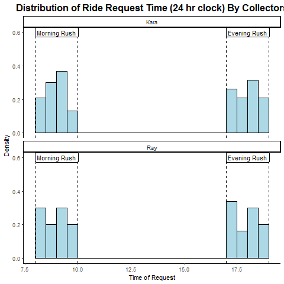
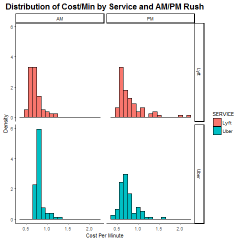

```{r setup, include=FALSE}
knitr::opts_chunk$set(echo = F)
```

```{r, echo=FALSE, message=F, warning=F}
library(knitr)
library(tidyverse)
library(lubridate)
library(stringr)
library(ggplot2)
library(ggthemes)
library(ggrepel)
library(dslabs)
library(lubridate)
ds_theme_set(new="theme_classic")
```


## Overview & Motivation


The Harvard T.H. Chan School of Public Health is located in the Longwood Medical area in Boston, while the main Harvard University campus is located in Cambridge. Many Harvard Chan students, staff, and faculty choose to live in Cambridge, and others cross-register for classes or attend events that are offered on the main campus. Thus, there is a need to determine the most cost-effective and efficient commute option between the two campuses, especially during rush-hour periods. The M2 shuttle provides a free option but can be unreliable, crowded, inflexible due to its set schedule, and takes an inefficient route in order to stop at popular locations along Massachusetts Avenue. The MBTA offers several routes that are also inefficient and can experience heavy traffic. A better option may be travel by car.

Taking Uber or Lyft may save time that could better be spent studying or working, especially if we can determine the best time to travel and the best service to use in order to get a good price. 

## Background

There are dozens of online resources that compare different aspects of Uber, Lyft, and sometimes taxi services. Some interesting examples are:

* This article by [RideGuru](https://ride.guru/content/newsroom/uber-vs-lyft-vs-taxi-cost-analysis-across-the-united-states) shows a side-by-side price comparison of all three services in Boston and compares the Boston prices for a 4-mile ride to prices in other cities around the U.S. The figure on the website shows that Lyft was slightly cheaper in Boston, based on the data they gathered. 
* Another article by [Alvia](http://www.alvia.com/lyft-vs-uber/) presents an estimate of the pricing algorithms for each service. It says that Uber fares are generally cheaper nationwide, but the price comparison is dependent on location and whether there is a surge.
* Finally, [FareEstimate.com](http://www.fareestimate.com/) is a website where users can input a pickup and dropoff location and instantly view a price comparison of all Uber and Lyft services.

Both the [Uber](https://help.uber.com/h/d2d43bbc-f4bb-4882-b8bb-4bd8acf03a9d) and [Lyft](https://help.lyft.com/hc/en-us/articles/214218147-How-to-calculate-a-Lyft-ride-s-cost) websites are vague about their pricing algorithm, which seems to be partially due to the new upfront pricing feature in both apps, as well as possible pricing differences by city.

## Initial Questions

Our primary objective was to determine which ride service, UberX or Lyft (standard car service, not LyftLine), was a better option for traveling the 4.7 miles by car from the Longwood campus to the Cambridge campus during the morning (8-10am) and evening (5-7pm) rush hour periods. Through data visualization, we hoped to establish a guide for when to take each service. The following research questions guided our project:

* Which service is cheaper overall for our chosen route?
* What do the time of day/day of week trends in fares look like for each service?
* Which service is preferable based on cost and wait time during morning and evening rush hour?
* Which service has a shorter wait time and/or expectated time to destination?
* How does the cost per expected minute of travel compare for each service?

## The Data

After checking the Uber and Lyft online dataset, they did not provide any price data, so we decided to create our own dataset.

We decided to collect the data ourselves. The 4-week collection period ran Monday-Friday from November 6 - December 1. We aimed to collect a total of 16 data points each day (8 Uber/Lyft pairs) for a total goal of 320 data points. Each team member used screenshots on his/her phone to collect the data each day: 1 Uber observation and 1 Lyft observation at random times between 8-9am, 9-10am, 5-6pm, and 6-7pm.

Each team member collected when they were able during each hour frame, with the hope that our collection times would be somewhat "random" and we would accumulate enough data over each time interval for meaningful analysis. We used the Uber and Lyft App to set the position from Vanderbilt Hall to Widener Gate. Then, we took a screenshot of the estimated price, wait time, and duration time for a standard ride (not "Pool" or "Line"). Later on that day, we imported our data on into a spreadsheet. An example data screenshot and a portion of the data collection spreadsheet can be found below:

### Sample Screenshots

 


### Data Collection Spreadsheet

Below is the first portion our our data collection spreadsheet, to give an idea of how we collected data. Variable descriptions are provided later on.

```{r, echo=F, message=F, warning=F}
#Reading in data
data_location <- paste(getwd(),"/FREEZE_FINAL_4DEC2017.csv", sep="")
data <- read.csv(data_location, stringsAsFactors = F)
head(data) %>% kable(align='c')
```

### Data Cleaning and Formatting

The code below shows our data cleaning/formatting process. Variable specifications can be found in the comments of the code and are also displayed in the table following the code.

There were 6 scheduled observation times for which data for both Uber and Lyft was not collected. We assumed that those were missing completely at random and removed them from the dataset. The only other missing data point was the arrival time (and therefore duration and cost/minute) for a Lyft data point between 8-9am on November 16. This happened because a screenshot was taken before the app displayed the estimated arrival time. We assumed this was also random and removed this observation. The resulting dataset has 313 observations.

```{r, echo=T, message=F}
#Formatting and cleaning data
#   DATE: Date of request. Format=date (need to specify further based on R formats avail.)
#   DAY_OF_WK: Day of week of request. Format=factor w/ 5 levels
#   REQUEST_DATETIME: Date and time combined. Format=R date
#   TIME: Time of request, calculated as hours/min since start of the day. Format=R time
#   SERVICE: Uber/Lyft. Format=factor w/ 2 levels
#   COST: Cost of ride. Format=numeric double
#   WAIT_TIME: Estimated wait time. Format=numeric
#   ARRIVAL_TIME: Estimated time of arrival. Format=R time (specify further)
#   ARRIVAL_DATETIME: Combined estimated date and time of arrival. Format=R date time.
#   TOTAL_DURATION: Estimated duration incl. wait time. Format=numeric
#   COLLECTOR: Kara/Ray. Format=factor w/ 2 levels
#   AM_PM: AM/PM request time. Format=Factor w/ 2 levels, need to derive\
#   COST_PER_MIN: Cost in dollars per minute of estimated duration. Format=numeric
#   TIME_FROM_MID: Absolute value of time from our defined midpoint of rush hour (midpoint=9am morning, 6pm evening)
data2 <- data %>% mutate(DATE=mdy(DATE),
                         DAY_OF_WK=factor(DAY_OF_WK, levels=c("Monday", 
                                                              "Tuesday", 
                                                              "Wednesday",
                                                              "Thursday",
                                                              "Friday")),
                         DATETIME=as.POSIXct(paste(DATE,TIME),format="%Y-%m-%d %H:%M"),
                         TIME=DATETIME-as.POSIXct(paste(DATE,"00:00:00"), format="%Y-%m-%d %H:%M"),
                         SERVICE=as.factor(SERVICE),
                         ARRIVAL_DATETIME=as.POSIXct(paste(DATE,ARRIVAL_TIME),format="%Y-%m-%d %H:%M"),
                         ARRIVAL_TIME=ARRIVAL_DATETIME-as.POSIXct(paste(DATE,"00:00:00"), format="%Y-%m-%d %H:%M"),
                         COLLECTOR=as.factor(COLLECTOR),
                         AM_PM=as.factor(ifelse(TIME>8 & TIME<10, "AM", "PM")),
                         COST_PER_MIN=COST/as.numeric(TOTAL_DURATION),
                         TIME_FROM_MID=ifelse(AM_PM=="AM",abs(TIME-9), abs(TIME-18))
                           ) %>%
                    filter(is.na(ARRIVAL_TIME)=="FALSE")

data2_AM <- data2 %>% filter(AM_PM=="AM")
data2_PM <- data2 %>% filter(AM_PM=="PM")
```

### Variable Specifications

```{r, message=F}
#FILL IN THE REST OF THE VALUES LATER
Variable <- names(data2)
Description <- c("Date of Request: mm-dd-yyyy", 
                 "Day of Week of Request: Monday-Friday",
                 "Time of Request (24 hour clock), measured as a difference from midnight",
                 "Car Service: Uber or Lyft",
                 "Total fare for ride ($)",
                 "Estimated wait time (minutes)",
                 "Estimated arrival time (24 hour clock), measured as a difference from midnight",
                 "Estimated total duration, including wait time (minutes) = ARRIVAL_TIME-TIME",
                 "Person who collected the data: Kara or Ray",
                 "Date and time of ride request",
                 "Date and time of expected arrival",
                 "Denotes whether ride was during morning/evening: AM or PM",
                 "Estimated cost per minute = COST/TOTAL_DURATION",
                 "Absolute time difference of request from midpoint of rush hour (9am or 6pm)")
                 
Format <- c("Date", "Factor", "Time Difference", "Factor",
            "Numeric", "Integer", "Time Difference", "Integer",
            "Factor", "Date", "Date", "Factor", "Numeric", "Numeric")
var_table <- data.frame(cbind(Variable, Format, Description))
var_table %>% kable(align='l')
```

## Exploratory Analysis

### Univariate Statistics

We used the `summary` function to examine the values of the data and ensure that none of our observations required examination to ensure that the reporting was accurate. After inspection, nothing seemed out of expected range, and we concluded that we could proceed.

```{r, echo=F, message=F}
summary(data2)
```

Because the output of the summary function is not in the clearest format and does not include standard deviation, we also wrote a function to produce a table of univariate statistics for our numeric variables.

```{r, echo=F, message=F}
numeric_summary <- function(variable){
  stats <- c("N", "Mean (SD)", "Median", "Min, Max")
  n <- as.character(length(variable))
  mean <- as.character(round(mean(variable),1))
  sd <- as.character(round(sd(variable),2))
  med <- as.character(round(median(variable),1))
  min <- as.character(min(variable))
  max <- as.character(max(variable))
  values <- c(n, 
              paste(mean, " (", sd, ")", sep=""),
              med, 
              paste(min, ", ", max, sep=""))
  output <- (cbind(stats,values))
  return(output)
}

cost_head <- c("Total Cost ($)", " ")
cost_stats <- numeric_summary(data2$COST)
wait_head <- c("Estimated Wait Time (min)", " ")
wait_stats <- numeric_summary(data2$WAIT_TIME)
dur_head <- c("Estimated Duration (min)", " ")
dur_stats <- numeric_summary(data2$TOTAL_DURATION)
cpm_head <- c("Cost per Minute ($)", " ")
cpm_stats <- numeric_summary(data2$COST_PER_MIN)
tfm_head <- c("Absolute Time from Rush Hour Midpoint (min)", " ")
tfm_stats <- numeric_summary(data2$TIME_FROM_MID)
empty <- c(" "," ")

numeric_smry_table <- rbind(cost_head, cost_stats,
                            wait_head, wait_stats,
                            dur_head, dur_stats,
                            cpm_head, cpm_stats,
                            tfm_head, tfm_stats)
rownames(numeric_smry_table) <- seq(1:dim(numeric_smry_table)[1])
colnames(numeric_smry_table) <- c("Statistic", "Value")
numeric_smry_table2 <- data.frame(numeric_smry_table)

numeric_smry_table2 %>% kable(align='l')
```

Talk about how now we're going to make some pretty plots:

### Time of Ride Request
ADD AXIS LABELS AND CENTER TITLE. MAYBE ADD COLOR.
```{r, warning=F, message=F, results='hide'}
#Get univariate plots
p <- data2 %>% ggplot()
##Ride request time distribution - graph shows all-day
png(filename="Plots/ridereq_distr.png")
p + geom_histogram(aes(as.numeric(TIME),..density..), breaks=seq(7.99,18.99,.5), color="black") +
  geom_vline(xintercept=c(8,10,17,19), lty=2) +
  geom_label(aes(label="Morning Rush", x=9, y=.6))+
  geom_label(aes(label="Evening Rush", x=18, y=.6))+
  ggtitle("Distribution of Ride Request Time (24 hr clock)")
dev.off()

```


The first plot we have is the distribution of the ride request time plot. We can find that ride request time during the morning rush hour is normally distributed, but druing the night rush hour, the ride requet time varies a lot. 

```{r, warning=F, message=F, results='hide'}
#Our code here
##Ride request time distribution BY COLLECTOR - graph shows all-day
png(filename="Plots/ridereq_distr_coll.png")
p + geom_histogram(aes(as.numeric(TIME),..density..),breaks=seq(7.99,18.99,.5),color="black") +
  geom_vline(xintercept=c(8,10,17,19), lty=2) +
  geom_label(aes(label="Morning Rush", x=9, y=.6))+
  geom_label(aes(label="Evening Rush", x=18, y=.6))+
  ggtitle("Distribution of Ride Request Time (24 hr clock)") +
  facet_wrap(~COLLECTOR, dir="v")
dev.off()
```



The second plot we have is the one that descirbe the ride request time distribution by collector, we can find that Ray's plot is more likly of the normally distributed, but both of them need to collect more data (after 6:30pm)druing the evening rush hour. 

### Cost

See if we can put cost histogram next to cost/min histogram. Then same for the boxplots. We can just put the image links in the markdown next to each other.

For the ride cost histogram, talk about the skew and how we noticed that this would limit the types of analyses we could do. Skew makes sense, right.
```{r, warning=F, message=F, results='hide'}
#Our code here

#Ride cost - histogram
png(filename="Plots/ridecost_distr.png")
p + geom_histogram(aes(COST,..density.., fill=SERVICE), color="black", binwidth = 2) +
  facet_grid(SERVICE~AM_PM) +
  ggtitle("Distribution of Cost by Service and AM/PM Rush")+
  theme(legend.position = "none")
dev.off()

```

The third plot we have is the distribution of cost by two service druing morning and evening rush hour by using histogram. 


```{r, warning=F, message=F, results='hide'}
#Ride cost - boxplot
# Calculate medians to label plot
p_med_cost <- data2 %>% group_by(SERVICE, AM_PM) %>% summarise(med_cost=median(COST))
# Make plot
png(filename="Plots/ridecost_distr_boxp.png")
p + geom_boxplot(aes(SERVICE, COST, fill=SERVICE)) +
  geom_text(data = p_med_cost, aes(x = SERVICE, y = med_cost, label = med_cost), size = 3, vjust = -1)+
  facet_wrap(~AM_PM) +
  ggtitle("Distribution of Total Cost by Service and AM/PM Rush")+
  theme(legend.position = "none")
dev.off()

```


 

The fourth plot we have is the distribution of cost by two service druing morning and evening rush hour by using boxplot, we find that in the moring rush hour, the Lyft is cheaper than uber, but in the evening rush hour, the two service are kind of similar, Lyft is still a little bit cheaper than Uber.


```{r, warning=F, message=F, results='hide'}
#Cost/min - histogram
png(filename="Plots/cost_per_min.png")
p + geom_histogram(aes(COST_PER_MIN,..density.., fill=SERVICE), color="black", binwidth=.1) +
  facet_grid(SERVICE~AM_PM) +
  ggtitle("Distribution of Cost/Min by Service and AM/PM Rush")+
  theme(legend.position = "none")
dev.off()
```


The fifth plot we have is the one that descirbe that the distribution of cost per minute by two service druing morning and evening rush hour by using histogram.

```{r, warning=F, message=F, results='hide'}
#Cost/min - box plot
# Calculate medians to label plot
p_med_costmin <- data2 %>% group_by(SERVICE, AM_PM) %>% summarise(med_costmin=median(COST_PER_MIN))
# Make plot
png(filename="Plots/cost_per_min_boxp.png")
p + geom_boxplot(aes(SERVICE, COST_PER_MIN, fill=SERVICE)) +
  geom_text(data = p_med_costmin, aes(x = SERVICE, y = med_costmin, label = round(med_costmin, 3)), size = 3, vjust = -1)+
  facet_wrap(~AM_PM) +
  ggtitle("Distribution of Cost/Min by Service and AM/PM Rush")+
  theme(legend.position = "none")
dev.off()
```

 


The sixth plot we have is the one that descirbe that the distribution of cost per minute by two service druing morning and evening rush hour by using boxplot. We can find that during the moring rush hour, the cost per minute of Lyft is cheaper than Uber. But druing the evening rush hour, the cost per minute of Uber is cheaper than Lyft. This happens becasue the total duration of Uber is longer than Lyft. 


```{r, warning=F, message=F, results='hide'}
#Wait time - histogram
png(filename="Plots/waittime_histo.png")
p + geom_histogram(aes(WAIT_TIME,..density.., fill=SERVICE), color="black", binwidth = 1) +
  facet_grid(SERVICE~AM_PM) +
  ggtitle("Distribution of Wait Time by Service and AM/PM Rush")+
  theme(legend.position = "none")
dev.off()
```


The seventh plot we have is the one that descirbe the distribution of wait time by two service during the morning and evening rush hour by using histogram. 

```{r, warning=F, message=F, results='hide'}
#Total duration - histogram
png(filename="Plots/totalduration_histo.png")
p + geom_histogram(aes(TOTAL_DURATION,..density.., fill=SERVICE), color="black", binwidth = 2) +
  facet_grid(SERVICE~AM_PM) +
  ggtitle("Distribution of Total Duration by Service and AM/PM Rush")+
  theme(legend.position = "none")
dev.off()
```


The eighth plot we have is the one that descirbe the distribution of total duration by two service during the morning and evening rush hour by using histogram. 


```{r, warning=F, message=F, results='hide'}
#Total duration - box plot
# Calculate medians to label plot
p_med_dur <- data2 %>% group_by(SERVICE, AM_PM) %>% summarise(med_dur=median(TOTAL_DURATION))
# Make plot
png(filename="Plots/totalduration_boxp.png")
p + geom_boxplot(aes(SERVICE, TOTAL_DURATION, fill=SERVICE)) +
  geom_text(data = p_med_dur, aes(x = SERVICE, y = med_dur, label = med_dur), size = 3, vjust = -1)+
  facet_wrap(~AM_PM) +
  ggtitle("Distribution of Duration by Service and AM/PM Rush")+
  theme(legend.position = "none")
dev.off()
```


 

The ninghth plot we have is the one that descirbe the distribution of total duration by two service during the morning and evening rush hour by using boxplot. We cna find that the during the morning rush hour, the total duration of Lyft is longer than uber, but during the night rush hour, the total duration of Lyft is shorter than Uber. 

```{r, warning=F, message=F, results='hide'}
#Plot price over time AM, all days combined/stratified by day of week (5 plots)
png(filename="Plots/price_am.png")
data2_AM %>% ggplot() + geom_point(aes(TIME, COST, color=SERVICE))+
  facet_wrap(~DAY_OF_WK, nrow = 1) +
  ggtitle("Morning Commute Cost vs Time of Day")+
  xlab("Time of Day")+
  ylab("Cost ($)")
dev.off()
```


The tenth plot we have is the one that compare the price for two service during the morning rush hour. We can find that Lyft is cheaper than Uber for most of time. 

```{r, warning=F, message=F, results='hide'}
#Plot price over time PM, all days combined/stratified by day of week (5 plots)
png(filename="Plots/price_pm.png")
data2_PM %>% ggplot() + geom_point(aes(TIME, COST, color=SERVICE))+
  facet_wrap(~DAY_OF_WK, nrow = 1) +
  ggtitle("Evening Commute Cost vs Time of Day")+
  xlab("Time of Day")+
  ylab("Cost ($)")
dev.off()
```

 

The evelenth plot we have is the one that compare the price for two service during the evening rush hour. We can find the price between the Lyft and uber is similar. 

ROTATE X AXIS LABELS, ADD TITLE
MAKE ANOTHER ONE STRATIFIED BY SERVICE

```{r, warning=F, message=F, results='hide', eval=F}
library(dplyr)
#Plot average price in 15 min increments, AM
png(filename="Plots/pricein15min.png")
data2 %>% 
  group_by(inc=cut(as.numeric(TIME), breaks=c(seq(8,10,.25), seq(17,19,.25)))) %>%
  summarize(mean=mean(COST)) %>%
  ggplot()+geom_col(aes(inc, mean))
dev.off()
```


The twelveth plot we have is the one that describe the average price in 15 minutes increments during the morning rush hour.

```{r, warning=F, message=F, results='hide'}
#Plot of cost vs total duration, color by service
png(filename="Plots/cost_totalduration.png")
p + geom_point(aes(TOTAL_DURATION, COST, color=SERVICE)) +
  ggtitle("Cost vs Total Duration") +
  xlab("Cost ($)")+
  ylab("Total Duration")
dev.off()
```


p + geom_point(aes(TOTAL_DURATION, COST, color=SERVICE)) +
  facet_grid(AM_PM~.)
dev.off()
```


The seventeenth plot we have is the one that describe the

#Final Analysis

```{r, echo=FALSE}
#Our code here
########SPEARMAN AND MANN-WHITNEY U TEST

#Spearman -> cor(x,y,method="spearman")
#Testing whether total ride duration and total cost are correlated
sp_dur_cost <- cor.test(data2$TOTAL_DURATION, data2$COST, method="spearman", exact=F)
print(sp_dur_cost)


```


We want to know whether total ride duration and total cost are correlated, we decide to use the SPEARMAN AND MANN-WHITNEY U TEST, and based on the result of the tes, we find that the total ride duration and total cost are correlated, the r=0.585. the p-value is less than 0.05.


```{r, echo=FALSE}
#Our code here
#Testing whether wait time and total cost are correlated
sp_wait_cost <- cor.test(data2$WAIT_TIME, data2$COST, method="spearman", exact=F)
print(sp_wait_cost)

```

We want to know whether whether wait time and total cost are correlated, we decide to use the SPEARMAN AND MANN-WHITNEY U TEST, and based on the result of the tes, we find that the wait time and total cost are correlated, the r=0.528. the p-value is less than 0.05.


```{r, echo=FALSE}
#Our code here
#Testing whether wait time and total cost/min are correlated
sp_wait_costmin <- cor.test(data2$WAIT_TIME, data2$COST_PER_MIN, method="spearman", exact=F)
print(sp_wait_costmin)
```


We want to know whether whether wait time and total cost/min are correlated, we decide to use the SPEARMAN AND MANN-WHITNEY U TEST, and based on the result of the tes, we find that the wait time and total cost are not that correlated, the r=-0.0268. the p-value is more than 0.05.

```{r, echo=FALSE}
#Our code here
#Mann-Whitney - Lyft comes first in the list of factors so less would test if Lyft costs less than Uber
#Tests prob that a randomly selected Uber price is greater than a randomly selected Lyft price
wilcox.test(data2$COST~data2$SERVICE, alternative="less", exact=F)
```

we wnat to tests probaility that a randomly selected Uber price is greater than a randomly selected Lyft price, than the test result told us that a randomly selected Uber price is greater than a randomly selected Lyft price. 


```{r, echo=FALSE}
#Same test just for AM
wilcox.test(data2_AM$COST~data2_AM$SERVICE, alternative="less", exact=F)
```

we wnat to tests probaility that a randomly selected Uber price is greater than a randomly selected Lyft price duing the morning rush hour, than the test result told us that a randomly selected Uber price is greater than a randomly selected Lyft price during the morning rush hour. 


```{r, echo=FALSE}
#Same test just for PM
wilcox.test(data2_PM$COST~data2_PM$SERVICE, alternative="less", exact=F)

```


we wnat to tests probaility that a randomly selected Uber price is greater than a randomly selected Lyft price during the evening rush hour, than the test result told us that a randomly selected Uber price is not greater than a randomly selected Lyft price during the evening rush hour. 

```{r, echo=FALSE}
#Tests prob that a randomly selected Uber cost/min is greater than a rand sel Lyft cost/min
wilcox.test(data2$COST_PER_MIN~data2$SERVICE, alternative="less", exact=F)

```

we wnat to tests prob that a randomly selected Uber's cost per minute is greater than a rand selected Lyft's  cost per minute, than the test result told us that a randomly selected Uber's cost per minute is greater than a randomly selected Lyft's  cost per minute.
